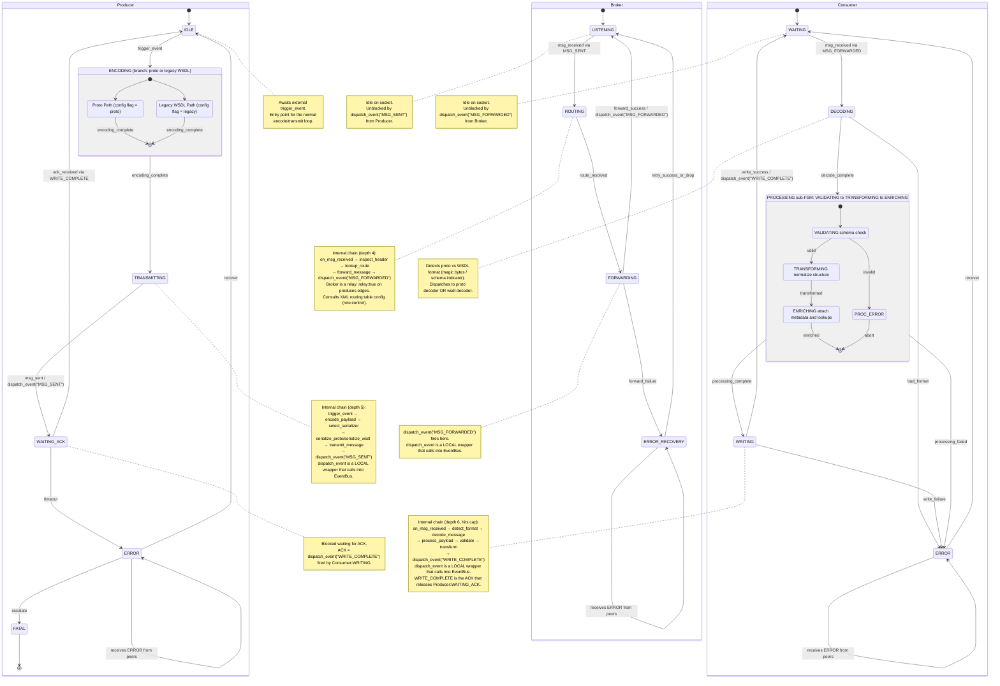
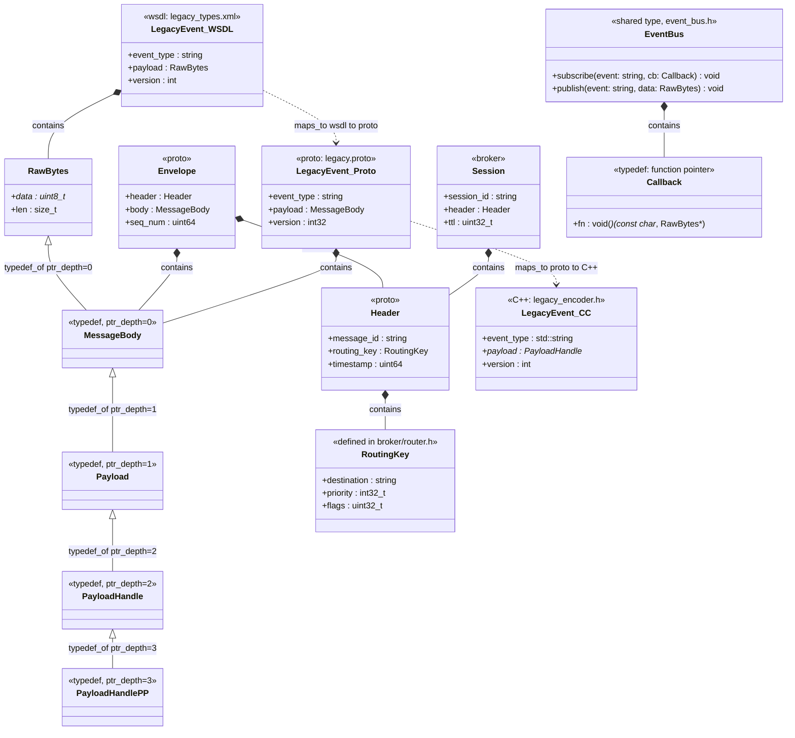

# CodeGrapherStressTest — Ground Truth Specification

> This file is the authoritative specification for the stress-test codebase.
> It was authored BEFORE the code was written and serves as the reference against
> which CodeGrapher output should be verified.

---

## 1. FSM of FSMs — stateDiagram-v2



---

## 2. Type / Struct Hierarchy — classDiagram



---

## 3. Ground Truth Tables

### 3.1 All States

| Service | State | Role |
|---|---|---|
| Producer | IDLE | Quiescent. Awaits `trigger_event`. Entry to normal loop. |
| Producer | ENCODING | Serializes payload. Branches on config flag: proto path or legacy WSDL path. |
| Producer | ENCODING::ProtoPath | Calls `serialize_proto()`, produces `Envelope` (proto). |
| Producer | ENCODING::LegacyWSDLPath | Calls `serialize_wsdl()`, produces `LegacyEvent_WSDL`. |
| Producer | TRANSMITTING | Sends encoded message to Broker. Fires `dispatch_event("MSG_SENT")` on completion. |
| Producer | WAITING_ACK | Blocked. ACK = `WRITE_COMPLETE` from Consumer. Timeout → ERROR. |
| Producer | ERROR | Recoverable. → IDLE on recover, → FATAL on escalate. Receives peer ERROR notifications. |
| Producer | FATAL | Terminal. No recovery. |
| Broker | LISTENING | Quiescent on socket. Unblocked by `MSG_SENT`. |
| Broker | ROUTING | Inspects header, consults XML routing table (role:control), resolves destination. |
| Broker | FORWARDING | Sends to Consumer. Fires `dispatch_event("MSG_FORWARDED")` on success. relay:true on all produces edges. |
| Broker | ERROR_RECOVERY | Retries or drops. Returns to LISTENING. Receives peer ERROR notifications. |
| Consumer | WAITING | Quiescent on socket. Unblocked by `MSG_FORWARDED`. |
| Consumer | DECODING | Detects wire format, dispatches to proto or WSDL decoder. |
| Consumer | PROCESSING | Outer state wrapping the Processing sub-FSM. |
| Consumer | PROCESSING::VALIDATING | Schema validation of decoded payload. |
| Consumer | PROCESSING::TRANSFORMING | Normalizes to canonical internal form. |
| Consumer | PROCESSING::ENRICHING | Attaches metadata, performs lookups. Final sub-state. |
| Consumer | PROCESSING::PROC_ERROR | Sub-FSM error sink. Causes outer PROCESSING to report failure. |
| Consumer | WRITING | Writes output to sink. Fires `dispatch_event("WRITE_COMPLETE")` (the ACK). |
| Consumer | ERROR | Recoverable. → WAITING on recover. Receives peer ERROR notifications. |

### 3.2 All Transitions

| From | To | Guard / Trigger |
|---|---|---|
| Producer:IDLE | Producer:ENCODING | `trigger_event` |
| Producer:ENCODING::ProtoPath | Producer:ENCODING (exit) | `encoding_complete` |
| Producer:ENCODING::LegacyWSDLPath | Producer:ENCODING (exit) | `encoding_complete` |
| Producer:ENCODING | Producer:TRANSMITTING | `encoding_complete` |
| Producer:TRANSMITTING | Producer:WAITING_ACK | `msg_sent` |
| Producer:WAITING_ACK | Producer:IDLE | `ack_received` (WRITE_COMPLETE callback) |
| Producer:WAITING_ACK | Producer:ERROR | `timeout` |
| Producer:ERROR | Producer:IDLE | `recover` |
| Producer:ERROR | Producer:FATAL | `escalate` |
| Broker:LISTENING | Broker:ROUTING | `msg_received` (after MSG_SENT) |
| Broker:ROUTING | Broker:FORWARDING | `route_resolved` |
| Broker:FORWARDING | Broker:LISTENING | `forward_success` |
| Broker:FORWARDING | Broker:ERROR_RECOVERY | `forward_failure` |
| Broker:ERROR_RECOVERY | Broker:LISTENING | `retry_success_or_drop` |
| Consumer:WAITING | Consumer:DECODING | `msg_received` (after MSG_FORWARDED) |
| Consumer:DECODING | Consumer:PROCESSING | `decode_complete` |
| Consumer:DECODING | Consumer:ERROR | `bad_format` |
| Consumer:PROCESSING::VALIDATING | Consumer:PROCESSING::TRANSFORMING | `valid` |
| Consumer:PROCESSING::VALIDATING | Consumer:PROCESSING::PROC_ERROR | `invalid` |
| Consumer:PROCESSING::TRANSFORMING | Consumer:PROCESSING::ENRICHING | `transformed` |
| Consumer:PROCESSING::ENRICHING | Consumer:PROCESSING (exit) | `enriched` |
| Consumer:PROCESSING::PROC_ERROR | Consumer:PROCESSING (exit, failure) | `abort` |
| Consumer:PROCESSING | Consumer:WRITING | `processing_complete` |
| Consumer:PROCESSING | Consumer:ERROR | `processing_failed` |
| Consumer:WRITING | Consumer:WAITING | `write_success` |
| Consumer:WRITING | Consumer:ERROR | `write_failure` |
| Consumer:ERROR | Consumer:WAITING | `recover` |

### 3.3 Cross-FSM Callbacks

| # | Fired By | State | Event | Received By | Effect |
|---|---|---|---|---|---|
| 1 | Producer | TRANSMITTING | `"MSG_SENT"` | Broker | LISTENING → ROUTING |
| 2 | Broker | FORWARDING | `"MSG_FORWARDED"` | Consumer | WAITING → DECODING |
| 3 | Consumer | WRITING | `"WRITE_COMPLETE"` | Producer | WAITING_ACK → IDLE (this is the ACK) |
| 4 | Producer | ERROR | `"ERROR"` | Broker, Consumer | Peers notified |
| 4 | Broker | ERROR_RECOVERY | `"ERROR"` | Producer, Consumer | Peers notified |
| 4 | Consumer | ERROR | `"ERROR"` | Producer, Broker | Peers notified |

### 3.4 dispatch_event — Local Wrappers (intentional tracing stress)

Each service has its own `dispatch_event()` symbol. All three call into the shared `EventBus::publish()`.

| Symbol | File | Calls into |
|---|---|---|
| `producer::dispatch_event` | `producer/callbacks.cc` | `EventBus::publish` |
| `broker::dispatch_event` | `broker/relay.cc` | `EventBus::publish` |
| `consumer::dispatch_event` | `consumer/output.cc` | `EventBus::publish` |

**CodeGrapher expected output:** 3 distinct symbol nodes, all with `calls` edge to 1 shared `EventBus` type node.

### 3.5 Internal Call Chains (per service)

**Producer (depth 5):**
```
trigger_event → encode_payload → select_serializer
  → serialize_proto | serialize_wsdl → transmit_message
  → dispatch_event("MSG_SENT")
```

**Broker (depth 4):**
```
on_msg_received → inspect_header → lookup_route
  → forward_message → dispatch_event("MSG_FORWARDED")
```
All Broker produces edges: `relay:true` (Broker never originates data, only forwards).

**Consumer (depth 6 — hits cap):**
```
on_msg_received → detect_format → decode_message
  → process_payload → validate → transform
  → dispatch_event("WRITE_COMPLETE")
```

**Cross-service accumulated depth (naive trace):** 5 + 4 + 6 = 15+ hops. Each service is individually within cap. Stress target: agents that do not respect service boundaries.

### 3.6 Type Relationships

| Type | Related Type | Relation | Detail |
|---|---|---|---|
| `RawBytes` | `MessageBody` | `typedef_of` | ptr_depth=0, direct value |
| `MessageBody` | `Payload` | `typedef_of` | ptr_depth=1, pointer |
| `Payload` | `PayloadHandle` | `typedef_of` | ptr_depth=2, pointer-to-pointer |
| `PayloadHandle` | `PayloadHandlePP` | `typedef_of` | ptr_depth=3 |
| `Envelope` | `Header` | `contains` | proto nesting |
| `Envelope` | `MessageBody` | `contains` | proto nesting |
| `Header` | `RoutingKey` | `contains` | RoutingKey defined in broker/router.h |
| `Session` | `Header` | `contains` | Session in broker/relay.h; Header crosses file boundary |
| `LegacyEvent_WSDL` | `LegacyEvent_Proto` | `maps_to` | wsdl→proto bridge (same logical event) |
| `LegacyEvent_Proto` | `LegacyEvent_CC` | `maps_to` | proto→C++ bridge |
| `LegacyEvent_WSDL` | `RawBytes` | `contains` | payload field in WSDL variant |
| `LegacyEvent_Proto` | `MessageBody` | `contains` | payload field in proto variant |
| `EventBus` | `Callback` | `contains` | Callback is a typedef of function pointer |

### 3.7 Error Propagation

| Origin | Local response | Cross-FSM notification |
|---|---|---|
| Producer WAITING_ACK timeout | → Producer:ERROR | `dispatch_event("ERROR")` → Broker + Consumer |
| Producer ERROR escalate | → Producer:FATAL (terminal) | none |
| Broker FORWARDING failure | → Broker:ERROR_RECOVERY | `dispatch_event("ERROR")` → Producer + Consumer |
| Consumer DECODING bad_format | → Consumer:ERROR | `dispatch_event("ERROR")` → Producer + Broker |
| Consumer PROCESSING failure | → Consumer:ERROR | `dispatch_event("ERROR")` → Producer + Broker |
| Consumer WRITING failure | → Consumer:ERROR | `dispatch_event("ERROR")` → Producer + Broker |
| Consumer PROCESSING::PROC_ERROR | → sub-FSM abort → outer PROCESSING failure | handled by outer PROCESSING → ERROR path |

### 3.8 Encoding / Decoding Symmetry

| Config flag | Producer path | Encoder symbol | Consumer decoder |
|---|---|---|---|
| `proto` | ENCODING::ProtoPath | `serialize_proto` in `encoder.cc` | `decode_proto` in `consumer/decoder.cc` |
| `legacy` | ENCODING::LegacyWSDLPath | `serialize_wsdl` in `legacy_encoder.cc` | `decode_wsdl` in `consumer/decoder.cc` |

Consumer `detect_format()` inspects the wire and dispatches to the matching decoder. The `LegacyEvent` `maps_to` bridge connects both paths at the type level.

---

## 3.9 CodeGrapher Expected Output Counts

Verified against `py CodeGrapher/run.py --feature stress --root . --dir CodeGrapherStressTest`
after implementing return-type tracking, `modifies` edge type, and C++ local-variable type tracking.

### Node counts

| Type | Expected |
|---|---|
| file | 33 |
| symbol | 179 |
| type | 39 |

### Edge counts

| Relation | Expected | Notes |
|---|---|---|
| calls | 70 | 9 unresolved (targets outside corpus) |
| typedef_of | 4 | ptr_depth chain: RawBytes→MessageBody→Payload→PayloadHandle→PayloadHandlePP |
| maps_to | 6 | LegacyEvent_WSDL→Proto→CC (×2 directions) + WSDL service→binding |
| modifies | 100 | Non-const pointer (`T*`) and non-const reference (`T&`) parameters. Each function declaration (.h) and definition (.cc) emits separate edges → ~50 unique function×type pairs × 2 files. Dominated by FSM state-machine functions (init/run/handle_*) that take `FsmType*`. |

### What changed from pre-modifies baseline

Before this feature, non-const pointer params emitted `produces(via=param_mutation)` + `consumes`.
After: they emit `modifies` only. The `calls`, `typedef_of`, and `maps_to` counts are unchanged.

---

## 4. File Map

| File | Primary responsibility |
|---|---|
| `producer/types.h` | `RawBytes`, typedef chain, `EventBus`, `Callback` |
| `producer/callbacks.h/.cc` | `dispatch_event` wrapper, `on_state_change`, `subscribe`/`register` |
| `producer/state_machine.h/.cc` | Producer FSM: IDLE→ENCODING→TRANSMITTING→WAITING_ACK loop |
| `producer/encoder.h/.cc` | Proto path: `encode_payload`, `select_serializer`, `serialize_proto`, `transmit_message` |
| `producer/legacy_encoder.h/.cc` | WSDL path: `serialize_wsdl`, `LegacyEvent_CC` struct |
| `producer/main.cc` | Entry point. Instantiates FSM, calls `trigger_event`. |
| `broker/router.h/.cc` | `RoutingKey`, `inspect_header`, `lookup_route` (consumes XML config, role:control) |
| `broker/relay.h/.cc` | `Session`, `on_msg_received`, `forward_message`, `dispatch_event` wrapper, relay:true |
| `broker/main.cc` | Entry point. Instantiates broker FSM. |
| `consumer/decoder.h/.cc` | `detect_format`, `decode_proto`, `decode_wsdl`, `decode_message` |
| `consumer/processor.h/.cc` | `process_payload`, `validate`, `transform`, `enrich` (sub-FSM) |
| `consumer/output.h/.cc` | `write_output`, `dispatch_event` wrapper |
| `consumer/main.cc` | Entry point. Instantiates consumer FSM. |
| `proto/messages.proto` | `Envelope`, `Header`, `MessageBody` |
| `proto/events.proto` | Event message types used by `dispatch_event` |
| `proto/legacy.proto` | `LegacyEvent_Proto` (transition type, maps_to WSDL) |
| `wsdl/legacy_service.xml` | WSDL 1.1 service definition for legacy path |
| `wsdl/legacy_types.xml` | XSD type definitions: `LegacyEvent_WSDL`, `RawBytes` |
| `config/broker_config.xml` | Routing table consumed by `lookup_route` (role:control) |
| `config/producer_config.xml` | Serialization flag, retry policy consumed by Producer FSM |
