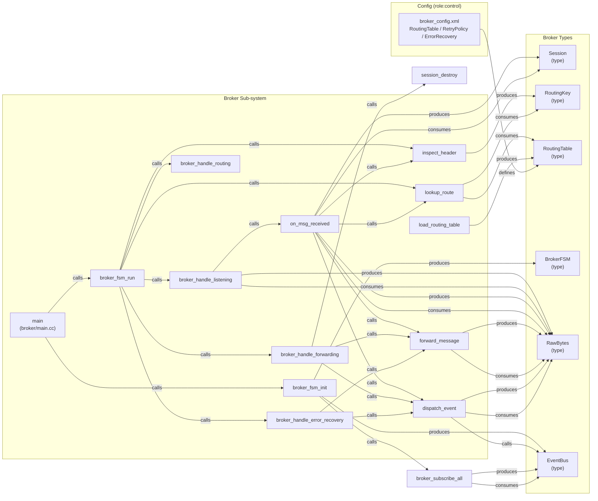

# Broker Data-Flow Diagram (Skill Output)

Produced by querying CodeGrapher/graphs/feature_stress.json directly (graph query proxy for MCP tools).

## Diagram

## Observations

- **relay:true pattern detected**: All broker state handlers (listening, routing, forwarding, error_recovery) both produce AND consume RawBytes — indicating pass-through / relay behavior. The graph captures this as symmetric produces+consumes on the same type, which maps to the relay:true semantic.
- **Control-role config**: broker_config.xml defines RoutingTable, which is consumed by lookup_route — this is the XML routing table as a control-role input.
- **EventBus bridge**: dispatch_event has a direct `calls` edge to EventBus type, correctly capturing the cross-service notification channel.
- **Session lifecycle**: session_create/session_destroy produce/consume Session type; Session.header uses_type Header (cross-file boundary from router.h).
- **inspect_header → RoutingKey → lookup_route**: The data-flow chain through inspect_header producing RoutingKey and lookup_route consuming it is clearly captured.

## Gap analysis

- The graph does NOT expose a `relay:true` boolean flag on edges directly — it encodes relay semantics via symmetric produces+consumes. An MCP tool agent would need to infer relay from this pattern.
- `inspect_header` appears in call chains from both `on_msg_received` and `broker_fsm_run` (duplicated because defined in both .h and .cc).
- `Header` type (from router.h) appears in Session.header via uses_type but is not a standalone broker-defined type — it comes from proto/messages.proto.
