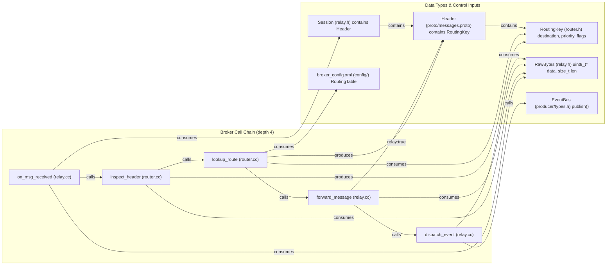

# Broker Data-Flow Diagram (Ground Truth)

## Source files read

- `CodeGrapherStressTest/broker/main.cc`
- `CodeGrapherStressTest/broker/relay.h`
- `CodeGrapherStressTest/broker/relay.cc`
- `CodeGrapherStressTest/broker/router.h`
- `CodeGrapherStressTest/broker/router.cc`
- `CodeGrapherStressTest/config/broker_config.xml`
- `CodeGrapherStressTest/GROUND_TRUTH.md` (sections 3.4, 3.5)

## Diagram

## Key Observations

1. **Call Chain Depth (4 hops)**: on_msg_received → inspect_header → lookup_route → forward_message → dispatch_event

2. **Relay Behavior**: All `produces` edges from the Broker are annotated `relay:true`. The broker never originates data — it only inspects the upstream message header, consults the XML routing table (role:control), and forwards the original RawBytes downstream.

3. **XML Config as Control Input**: `broker_config.xml` is consumed by `lookup_route()` via RoutingTable. It does NOT flow into the forwarded message payload — only shapes routing logic (role:control).

4. **EventBus Bridge**: `dispatch_event()` is the local Broker wrapper calling into the shared `EventBus::publish()` type. All three services' dispatch_event wrappers converge on this single type node.

5. **Type Relationships Across File Boundaries**: Header (proto/messages.proto) and RoutingKey (broker/router.h) form a cross-file contains edge. Session (broker/relay.h) also contains Header.

6. **Intentional Tracing Stress**: Three distinct dispatch_event symbol nodes (producer, broker, consumer) all call the same EventBus type node. Broker and Consumer produces edges should be relay:true.
