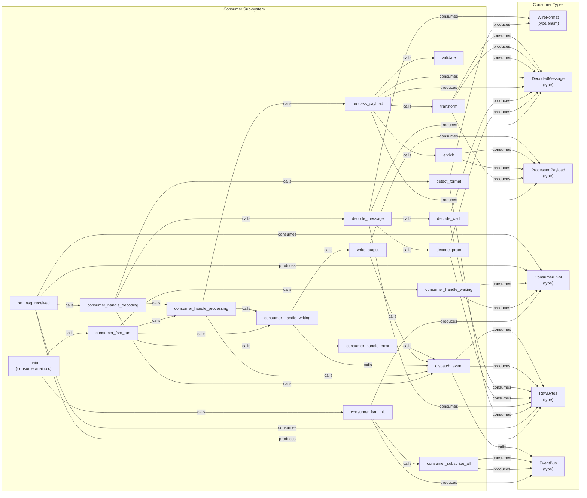

# Consumer Data-Flow Diagram (Skill Output)

Produced by querying CodeGrapher/graphs/feature_stress.json directly (graph query proxy for MCP tools).

## Diagram

## Observations

- **Full 6-hop chain captured**: on_msg_received → consumer_handle_decoding → detect_format/decode_message → consumer_handle_processing → process_payload → consumer_handle_writing → write_output → dispatch_event(WRITE_COMPLETE)
- **Proto/WSDL branch**: decode_message calls both decode_proto and decode_wsdl. detect_format produces WireFormat which decode_message consumes to dispatch correctly.
- **Sub-FSM chain**: process_payload calls validate → transform → enrich. transform and enrich produce/consume ProcessedPayload in sequence.
- **dispatch_event → EventBus**: Consumer's dispatch_event has a `calls` edge to EventBus, same pattern as broker and producer.
- **maps_to gap**: The graph does NOT show LegacyEvent_Proto or LegacyEvent_WSDL as consumer-side types. The maps_to edges for LegacyEvent exist at the producer/proto level but consumer decoder only sees RawBytes → DecodedMessage. This is a gap in what the graph exposes for consumer eval.

## Gap analysis

- LegacyEvent maps_to bridge is NOT directly visible from consumer-side graph data — it would require cross-subsystem type tracing (find_type("LegacyEvent") across all nodes).
- consumer_handle_decoding also has a `calls dispatch_event` edge for error cases (bad_format → ERROR state), which is captured.
- The graph captures `on_msg_received` in consumer/state_machine.cc (not decoder.cc) — it's the FSM handler, not the decoder entry.
