# Consumer Data-Flow Diagram (Ground Truth)

## Source files read
- CodeGrapherStressTest/consumer/main.cc
- CodeGrapherStressTest/consumer/decoder.h
- CodeGrapherStressTest/consumer/decoder.cc
- CodeGrapherStressTest/consumer/processor.h
- CodeGrapherStressTest/consumer/processor.cc
- CodeGrapherStressTest/consumer/output.h
- CodeGrapherStressTest/consumer/output.cc
- CodeGrapherStressTest/proto/messages.proto
- CodeGrapherStressTest/proto/legacy.proto
- CodeGrapherStressTest/wsdl/legacy_types.xml
- CodeGrapherStressTest/GROUND_TRUTH.md (sections 3.5-3.6)

## Diagram

```mermaid
flowchart LR
    START["on_msg_received (depth 1)"]
    D2["detect_format (depth 2) → WireFormat"]
    D3["decode_message (depth 3) WireFormat CONTROL"]
    D3_PROTO["decode_proto (proto branch) → Envelope"]
    D3_WSDL["decode_wsdl (wsdl branch) → LegacyEvent_WSDL"]
    DECODED["DecodedMessage* (merged paths)"]
    D4["process_payload (depth 4)"]
    D5["validate (depth 5) → int valid"]
    D6["transform (depth 6 CAP) → ProcessedPayload*"]
    ENRICH["enrich (param_mutation metadata)"]
    PROC["ProcessedPayload* (normalized)"]
    WRITE["write_output (Consumer:WRITING)"]
    DISPATCH["dispatch_event (WRITE_COMPLETE consumer wrapper)"]
    EVENTBUS["EventBus::publish (shared type, 3→1 convergence)"]
    ACK["WRITE_COMPLETE → Producer:WAITING_ACK"]

    ENV["Envelope (proto message)"]
    MSGBODY["MessageBody (typedef_of RawBytes)"]
    RAWBYTES["RawBytes (producer/types.h)"]
    LEGACY_WSDL["LegacyEvent_WSDL (wsdl/legacy_types.xml)"]
    LEGACY_PROTO["LegacyEvent_Proto (proto/legacy.proto)"]
    LEGACY_CC["LegacyEvent_CC (producer/legacy_encoder.h)"]

    START -->|produces| D2
    D2 -->|produces| D3
    D3 -->|"control: proto"| D3_PROTO
    D3 -->|"control: wsdl"| D3_WSDL
    D3_PROTO -->|produces| DECODED
    D3_WSDL -->|produces| DECODED
    DECODED -->|consumes| D4
    D4 -->|calls| D5
    D5 -->|produces| D4
    D4 -->|calls| D6
    D6 -->|produces| PROC
    PROC -->|data| ENRICH
    ENRICH -->|mutation| PROC
    PROC -->|consumes| WRITE
    WRITE -->|calls| DISPATCH
    DISPATCH -->|calls| EVENTBUS
    EVENTBUS -->|publishes| ACK

    ENV -->|contains| MSGBODY
    MSGBODY -.->|typedef_of| RAWBYTES
    D3_PROTO -.->|consumes| ENV
    LEGACY_WSDL -->|maps_to| LEGACY_PROTO
    LEGACY_PROTO -->|maps_to| LEGACY_CC
    LEGACY_WSDL -.->|contains| RAWBYTES
    LEGACY_PROTO -.->|contains| MSGBODY
    D3_WSDL -.->|bridge| LEGACY_CC
```

## Notes

### Depth-6 Chain (hits cap)
1. on_msg_received (depth 1) — Consumer:DECODING entry
2. detect_format (depth 2) — Magic byte detection (0x0A proto, 0x3C XML)
3. decode_message (depth 3) — Conditional dispatch on WireFormat
4. process_payload (depth 4) — Sub-FSM entry (VALIDATING → TRANSFORMING → ENRICHING)
5. validate (depth 5) — Schema check
6. transform (depth 6) — Normalize to ProcessedPayload; **cap fires after this**

### Proto vs WSDL Branch
- detect_format returns WireFormat (enum)
- decode_message uses WireFormat as control flag
- decode_proto: deserializes Envelope proto message
- decode_wsdl: deserializes LegacyEvent XML; bridges to LegacyEvent_Proto and LegacyEvent_CC via maps_to chain
- Both branches converge on DecodedMessage (canonical intermediate)

### maps_to Bridge
- LegacyEvent_WSDL (wsdl/legacy_types.xml): event_type, payload RawBytes, version int
- LegacyEvent_Proto (proto/legacy.proto): event_type, payload MessageBody, version int32
- LegacyEvent_CC (producer/legacy_encoder.h): event_type, payload PayloadHandle*, version int
- decode_wsdl bridges to the C++ endpoint of the chain

### WRITE_COMPLETE ACK
- consumer::dispatch_event (consumer/output.cc) → EventBus::publish (shared type)
- 3 local dispatch_event symbols (producer, broker, consumer) all converge to 1 EventBus type node
- Unblocks Producer:WAITING_ACK
- Naive depth accumulation across services = 15+; respecting boundaries keeps each ≤6

### Sub-FSM Processing
- VALIDATING: checks format, payload presence, version
- TRANSFORMING: normalizes to ProcessedPayload (depth 6 — cap boundary)
- ENRICHING: adds metadata (not counted in depth)
- PROC_ERROR: sub-FSM failure sink
