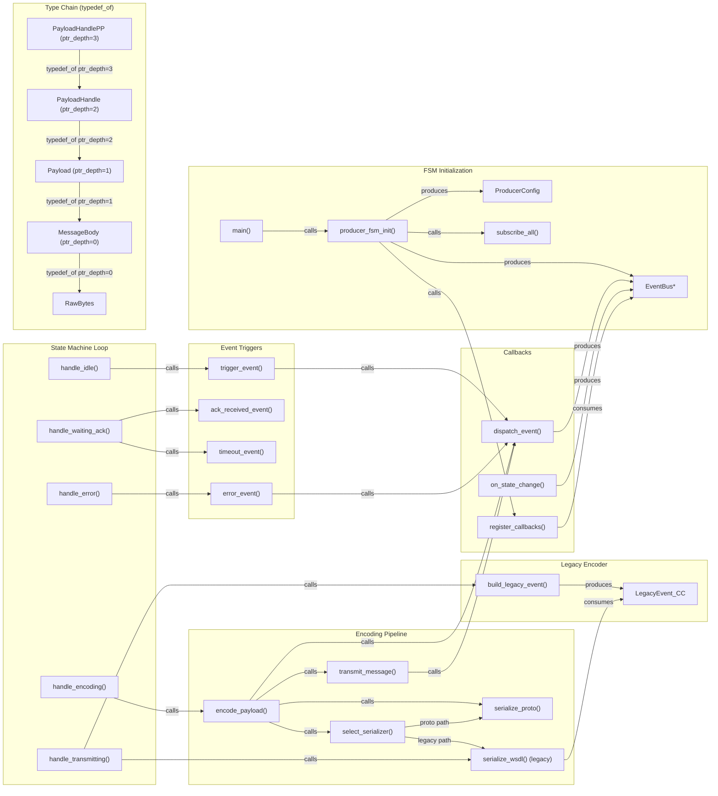

# Producer Data-Flow Diagram (Skill Output)

Produced by querying CodeGrapher/graphs/feature_stress.json directly (graph query proxy for MCP tools).

## Diagram

## Observations

### Typedef chain — ptr_depth IS stored on edges
The graph stores `ptr_depth` as a field on `typedef_of` edges: 0, 1, 2, 3. The chain is:
- RawBytes (base struct)
- MessageBody ← typedef_of RawBytes, ptr_depth=0
- Payload ← typedef_of MessageBody, ptr_depth=1
- PayloadHandle ← typedef_of Payload, ptr_depth=2
- PayloadHandlePP ← typedef_of PayloadHandle, ptr_depth=3

### Dual-path serialization
- Proto path: encode_payload → select_serializer → serialize_proto → produces Envelope
- Legacy path: handle_transmitting → build_legacy_event → produces LegacyEvent_CC → serialize_wsdl

### select_serializer branching
select_serializer checks ProducerConfig.use_proto. The graph shows it calling serialize_proto and serialize_wsdl (both branches encoded as calls edges).

### EventBus integration
18+ edges from producer components reference EventBus. dispatch_event, on_state_change, register_callbacks, subscribe_all all interact with it.

### relay field
NOT present on producer edges — correctly absent (relay:true only applies to broker).

## Gap analysis
- Envelope is defined in proto/messages.proto (not producer files) — requires cross-file type tracing to find
- EventEnvelope references unresolved EventType (external definition)
