# Producer Data-Flow Diagram (Ground Truth)

## Source files read
- CodeGrapherStressTest/producer/main.cc
- CodeGrapherStressTest/producer/state_machine.h
- CodeGrapherStressTest/producer/state_machine.cc
- CodeGrapherStressTest/producer/encoder.h
- CodeGrapherStressTest/producer/encoder.cc
- CodeGrapherStressTest/producer/legacy_encoder.h
- CodeGrapherStressTest/producer/legacy_encoder.cc
- CodeGrapherStressTest/producer/callbacks.h
- CodeGrapherStressTest/producer/callbacks.cc
- CodeGrapherStressTest/producer/types.h
- CodeGrapherStressTest/proto/messages.proto
- CodeGrapherStressTest/GROUND_TRUTH.md (sections 3.2, 3.5, 3.6)

## Diagram

```mermaid
flowchart LR
    main["main()"]
    fsm_init["producer_fsm_init()"]
    fsm_run["producer_fsm_run()"]
    trigger["trigger_event()"]

    main -->|calls| fsm_init
    main -->|calls| fsm_run
    fsm_run -->|calls| trigger

    trigger -->|hop 1| encode_payload["encode_payload()"]
    encode_payload -->|hop 2| select_serializer["select_serializer()"]
    select_serializer -->|"hop 3a: PATH_PROTO"| serialize_proto["serialize_proto()"]
    serialize_proto -->|hop 4| transmit_message["transmit_message()"]
    transmit_message -->|hop 5| dispatch_event["dispatch_event()"]
    dispatch_event -->|"calls EventBus::publish()"| EventBus["EventBus::publish()"]

    serialize_proto -->|"produces RawBytes*"| envelope["Envelope (proto)"]
    envelope -->|contains| header["Header"]
    envelope -->|contains| message_body["MessageBody"]
    header -->|contains| routing_key["RoutingKey"]

    encode_payload -->|alt path| build_legacy_event["build_legacy_event()"]
    select_serializer -->|"hop 3b: PATH_LEGACY_WSDL"| serialize_wsdl["serialize_wsdl()"]
    build_legacy_event -->|produces| LegacyEvent_CC["LegacyEvent_CC"]
    serialize_wsdl -->|consumes| LegacyEvent_CC
    serialize_wsdl -->|produces| RawBytes_wsdl["RawBytes (WSDL)"]
    serialize_wsdl -->|hop 4| transmit_message

    RawBytes["RawBytes"]
    MessageBody_t["MessageBody"]
    Payload["Payload"]
    PayloadHandle["PayloadHandle"]
    PayloadHandlePP["PayloadHandlePP"]

    RawBytes -->|"typedef_of ptr_depth=0"| MessageBody_t
    MessageBody_t -->|"typedef_of ptr_depth=1"| Payload
    Payload -->|"typedef_of ptr_depth=2"| PayloadHandle
    PayloadHandle -->|"typedef_of ptr_depth=3"| PayloadHandlePP

    encode_payload -->|"consumes PayloadHandlePP"| PayloadHandlePP
    build_legacy_event -->|"consumes PayloadHandlePP"| PayloadHandlePP

    dispatch_event -->|"emits MSG_SENT"| msg_sent["MSG_SENT event"]
    msg_sent -->|published via| EventBus

    LegacyEvent_CC -->|maps_to| LegacyEvent_Proto["LegacyEvent_Proto (proto)"]
    LegacyEvent_Proto -->|maps_to| LegacyEvent_WSDL["LegacyEvent_WSDL (wsdl)"]

    ProducerFSM["ProducerFSM"]
    ProducerConfig["ProducerConfig"]

    fsm_init -->|initializes| ProducerFSM
    fsm_init -->|consumes| ProducerConfig
    encode_payload -->|"consumes ProducerConfig"| ProducerConfig
    select_serializer -->|"consumes ProducerConfig"| ProducerConfig
```

## Notes

### The 5-Hop Internal Chain
1. trigger_event() → entry point
2. encode_payload() → hop 1; consumes PayloadHandlePP (ptr_depth=3)
3. select_serializer() → hop 2; consumes ProducerConfig, branches on use_proto flag
4. serialize_proto() | serialize_wsdl() → hop 3; branch based on config
5. transmit_message() → hop 4
6. dispatch_event("MSG_SENT") → hop 5; publishes to EventBus

### Typedef Chain (ptr_depth 0→3)
- RawBytes (concrete struct: uint8_t* data, size_t len)
- MessageBody = RawBytes (ptr_depth=0, direct alias)
- Payload = MessageBody* (ptr_depth=1)
- PayloadHandle = Payload* (ptr_depth=2)
- PayloadHandlePP = PayloadHandle* (ptr_depth=3)

### Proto vs WSDL Branch
- Proto path: config.use_proto=1 → serialize_proto() → produces Envelope
- WSDL path: config.use_proto=0 → build_legacy_event() → serialize_wsdl() → produces LegacyEvent_WSDL
- Both paths converge at transmit_message()

### LegacyEvent maps_to bridge
LegacyEvent_CC (C++) maps_to LegacyEvent_Proto (proto) maps_to LegacyEvent_WSDL (XML) — same logical event in three wire formats.

### dispatch_event → EventBus
Producer's local dispatch_event wrapper (callbacks.cc) calls EventBus::publish(). One of 3 identical-signature wrappers (producer, broker, consumer) all converging on 1 shared type node.
