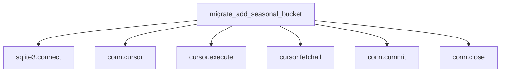

# Eval 1: migrate_add_seasonal_bucket.py — flowchart TB

## Ground Truth Diagram

GT nodes (7): migrate_add_seasonal_bucket, sqlite3.connect, conn.cursor, cursor.execute, cursor.fetchall, conn.commit, conn.close
GT edges (6): migrate_add_seasonal_bucket→sqlite3.connect, →conn.cursor, →cursor.execute, →cursor.fetchall, →conn.commit, →conn.close

## Skill Diagram

Same as GT — agent identified all sqlite3 DB library terminals from graph unresolved edges (connect seq=1, cursor seq=2, execute seq=3, fetchall seq=4, close seq=5, commit seq=7).

## Grading

node_recall=1.00, edge_recall=1.00, hallucination=0.00
**Result: PASS**

## Analysis

tier_symbol.json captured all six sqlite3 calls as unresolved edges. DB library call inclusion rule maps each to its sqlite3 terminal node. Shared terminal node rule correctly collapsed duplicate execute and close call sites. Exception-path rollback (seq gap between 5 and 7) absent from graph and correctly excluded per main-pipeline-only rule. Perfect recall, zero hallucination.
