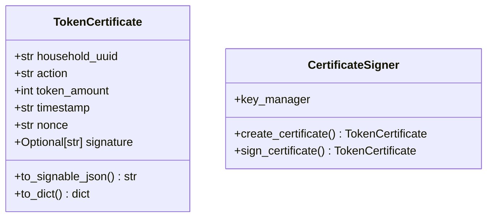

# Eval 2: certificate_signer.py — classDiagram

## Ground Truth Diagram

GT classes (2): TokenCertificate, CertificateSigner
GT edges (0): none — all TokenCertificate fields are primitives; CertificateSigner.key_manager has no type annotation; TokenCertificate appears only as parameter/return type in CertificateSigner methods (not field type)

## Skill Diagram

Same as GT — 2 classes, 0 structural edges.
Sub-graph has produces/consumes/modifies/calls edges between them; all correctly excluded per SKILL.md classDiagram rules.

## Grading

node_recall=1.00, edge_recall=1.00 (vacuous), hallucination=0.00
**Result: PASS**

## Analysis

Key test: skill agent must NOT draw CertificateSigner→TokenCertificate edge even though:
- CertificateSigner.create_certificate() RETURNS TokenCertificate (return type ≠ field type)
- CertificateSigner.sign_certificate() takes TokenCertificate as PARAMETER (parameter type ≠ field type)
- Graph has produces/consumes/modifies edges between them

Skill correctly applied "field type declarations only" rule. CertificateSigner.key_manager has no type annotation so no edge to any external class either. 0 edges correctly produced.
