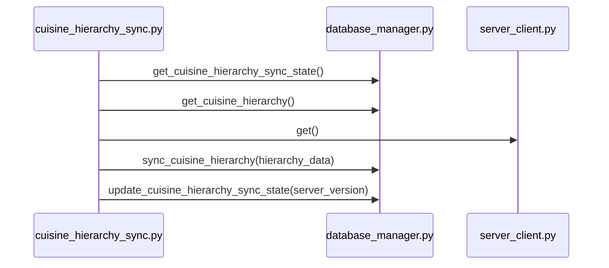

# Eval 3: cuisine_hierarchy_sync.py — sequenceDiagram

## Ground Truth Diagram

GT actors (3): cuisine_hierarchy_sync.py, database_manager.py, server_client.py
GT messages (5, after compression):
1. database_manager: get_cuisine_hierarchy_sync_state()
2. database_manager: get_cuisine_hierarchy()
3. server_client: get()
4. database_manager: sync_cuisine_hierarchy(hierarchy_data)
5. database_manager: update_cuisine_hierarchy_sync_state(server_version)

## Skill Diagram

Same as GT — correctly produced via instance method tracking rule (read source + docstrings).

## Grading

node_recall=1.00, edge_recall=1.00, hallucination=0.00
**Result: PASS**

## Analysis — Gap 1.5 confirmed, instance method tracking rule sufficient

This is a confirmed **Gap 1.5** scenario: constructor-injected dependencies.
- `self.db = db_manager` and `self.server_client = server_client` are injected in __init__
- Sub-graph (`main_Client_Side_utils_cuisine_hierarchy_sync.json`) has **zero cross-file edges** — all 13 edges are intra-file
- Gap 1.5 NOT implemented in parser → no resolved cross-file edges

Skill agent path that works:
1. Read source → find `self.db = db_manager` with docstring "db_manager: LocalDatabaseManager instance"
2. Match `LocalDatabaseManager` → `database_manager.py`
3. Read source → find `self.server_client = server_client` with docstring "server_client: ServerClient instance"
4. Match `ServerClient` → `server_client.py`
5. Trace ALL cross-file method calls (including inside private `_fetch_*` methods)
6. Apply repeated-call compression: get_cuisine_hierarchy_sync_state (2→1), get_cuisine_hierarchy (3→1), server_client.get (2→1)

Path that would FAIL: relying only on graph data → 0 cross-file edges → degenerate case → 1 participant, 0 messages (node_recall=0.33, edge_recall=0.00).

Private methods (_fetch_cuisine_version, _fetch_full_cuisine_hierarchy) correctly treated as intra-file arrows (suppressed), but their internal cross-file calls (server_client.get) ARE included because they are outgoing calls from cuisine_hierarchy_sync.py.

Conclusion: Gap 1.5 parser fix NOT needed — instance method tracking rule (read source + docstring type resolution) handles this case correctly.
