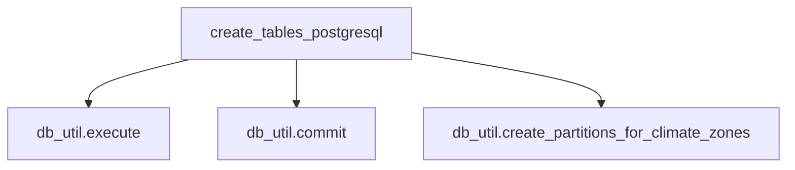

# Eval 4: create_tables_pg.py — flowchart TB

## Ground Truth Diagram

GT nodes (4): create_tables_postgresql, db_util.execute, db_util.commit, db_util.create_partitions_for_climate_zones
GT edges (3): create_tables_postgresql→db_util.execute, →db_util.commit, →db_util.create_partitions_for_climate_zones

Source evidence:
- db_util.execute() called 70+ times throughout function — shared terminal node rule collapses to ONE
- db_util.commit() called once (architecturally significant: DDL transactional, FK refs need committed target tables)
- db_util.create_partitions_for_climate_zones('RecipeSeasonality', CLIMATE_ZONES) called once
- insert_seasonal_buckets is a separate top-level function NOT called by create_tables_postgresql — excluded per main-pipeline-only rule

## Skill Diagram

Same as GT. Tier_symbol.json has edges from create_tables_postgresql with cross_file=True:
- create_tables_postgresql → PostgresDatabaseUtility.execute (seq=2)
- create_tables_postgresql → PostgresDatabaseUtility.commit (seq=7)
- create_tables_postgresql → PostgresDatabaseUtility.create_partitions_for_climate_zones (seq=76)

## Grading

node_recall=1.00, edge_recall=1.00, hallucination=0.00
**Result: PASS**

## Analysis

**Typed parameter annotation resolution confirmed:** `db_util: PostgresDatabaseUtility` is correctly resolved by the parser — all three method edges appear in tier_symbol.json with cross_file=true. Gap 1 fix handles typed parameter annotations (not just return type annotations from get_database() calls).

**Repeated call compression:** execute() called 70+ times but graph emits a single calls edge regardless of call site count — shared terminal node rule satisfied automatically at graph level.

**Sub-graph insufficiency finding:** main_Server_Side_db_create_tables_pg.json only contains file/symbol nodes with `defines` edges — ZERO cross-file call edges. A skill agent using only the sub-graph would produce node_recall=0.25 (FAIL). tier_symbol.json is required for actual call edge data. This is a referential sub-graph limitation for files that are not standalone scripts (no `__main__` block).

**Unexpected finding:** db_util.create_partitions_for_climate_zones() — a less obvious cross-file method beyond the expected execute/commit — was captured correctly in the graph.
