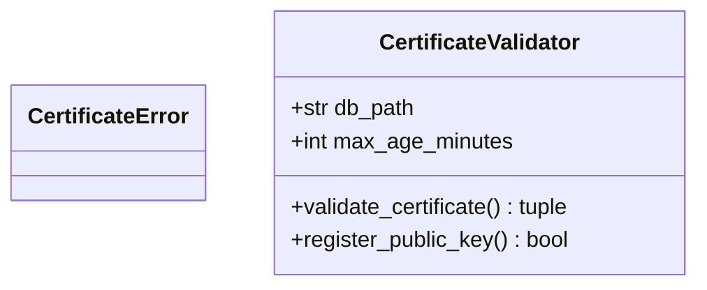

# Eval 5: certificate_validator.py — classDiagram

## Ground Truth Diagram

GT classes (2): CertificateError, CertificateValidator
GT edges (0): none — CertificateError is not a field type in CertificateValidator; all CertificateValidator fields are primitives (str, int); all imports are stdlib/third-party (sqlite3, cryptography, datetime)

## Skill Diagram

Same as GT — 2 classes, 0 structural edges.
Sub-graph has 2 TYPE nodes (CertificateError, CertificateValidator) and 0 field-type/typedef_of edges between them.

## Grading

node_recall=1.00, edge_recall=1.00 (vacuous), hallucination=0.00
**Result: PASS**

## Analysis

Key test: skill agent must NOT draw CertificateValidator→CertificateError edge. CertificateError is:
- Defined in the same file
- But NOT used as a field type in CertificateValidator
- Methods return (False, message) tuples rather than raising CertificateError directly
Even if CertificateError were raised, the SKILL.md rule is clear: raised exceptions are runtime behavior, not structural field-type relationships. Skill correctly produces 0 edges.
