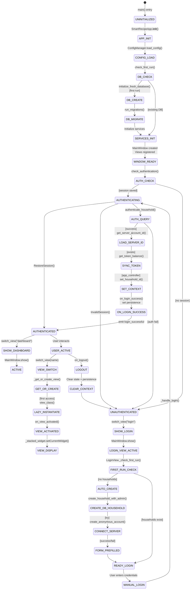

# Ground Truth — Client_Side/main.py

**Diagram type:** stateDiagram-v2 — Captures auth state machine (UNINITIALIZED → AUTHENTICATING → AUTHENTICATED/UNAUTHENTICATED) plus lazy initialization of backend services and lazy view instantiation, with clear state transitions on login/logout and user-facing actions.

**Key files read:** Client_Side/main.py, Client_Side/config/app_config.py, Client_Side/utils/server_client.py, Client_Side/ui_new/main_window.py, Client_Side/ui_new/views/login_view.py

**Nodes:** main, SmartRecipeApp, ConfigManager, LocalDatabaseManager, ServerClient, MainWindow, LoginView, DashboardView, CalendarView, AutofillPreferencesView, RecipeEntryView, SettingsView, UNINITIALIZED, APP_INIT, CONFIG_LOAD, DB_CHECK, DB_CREATE, DB_MIGRATE, SERVICES_INIT, WINDOW_READY, AUTH_CHECK, AUTHENTICATING, AUTHENTICATED, UNAUTHENTICATED, SHOW_DASHBOARD, SHOW_LOGIN, ACTIVE, LOGIN_VIEW_ACTIVE, FIRST_RUN_CHECK, AUTO_CREATE, CREATE_DB_HOUSEHOLD, CONNECT_SERVER, FORM_PREFILLED, READY_LOGIN, MANUAL_LOGIN, AUTH_QUERY, LOAD_SERVER_ID, SYNC_TOKEN, SET_CONTEXT, ON_LOGIN_SUCCESS, USER_ACTIVE, VIEW_SWITCH, GET_OR_CREATE, LAZY_INSTANTIATE, VIEW_ACTIVATED, VIEW_DISPLAY, LOGOUT, CLEAR_CONTEXT

**Edges:**
- main --> UNINITIALIZED (entry point)
- UNINITIALIZED --> APP_INIT (SmartRecipeApp.__init__ calls)
- APP_INIT --> CONFIG_LOAD (produces ConfigManager instance)
- CONFIG_LOAD --> DB_CHECK (check_first_run)
- DB_CHECK --> DB_CREATE (initialize_fresh_database on first run)
- DB_CREATE --> DB_MIGRATE (run_migrations)
- DB_MIGRATE --> SERVICES_INIT (LocalDatabaseManager, ServerClient created)
- SERVICES_INIT --> WINDOW_READY (MainWindow instantiated, views registered)
- WINDOW_READY --> AUTH_CHECK (check_authentication called)
- AUTH_CHECK --> AUTHENTICATING (saved session exists, verify household)
- AUTHENTICATING --> AUTHENTICATED (household found in DB)
- AUTHENTICATING --> UNAUTHENTICATED (saved session invalid)
- AUTH_CHECK --> UNAUTHENTICATED (no saved session)
- AUTHENTICATED --> SHOW_DASHBOARD (switch_view("dashboard"))
- UNAUTHENTICATED --> SHOW_LOGIN (switch_view("login"))
- SHOW_DASHBOARD --> ACTIVE (MainWindow.show)
- SHOW_LOGIN --> LOGIN_VIEW_ACTIVE (MainWindow.show)
- LOGIN_VIEW_ACTIVE --> FIRST_RUN_CHECK (LoginView._check_first_run on delay)
- FIRST_RUN_CHECK --> AUTO_CREATE (get_all_households returns empty)
- AUTO_CREATE --> CREATE_DB_HOUSEHOLD (create_household_with_admin)
- CREATE_DB_HOUSEHOLD --> CONNECT_SERVER (server health check, create_anonymous_account)
- CONNECT_SERVER --> FORM_PREFILLED (populate form with UUID and default password)
- FIRST_RUN_CHECK --> READY_LOGIN (households exist)
- FORM_PREFILLED --> READY_LOGIN (form auto-filled, awaiting login)
- READY_LOGIN --> MANUAL_LOGIN (user enters credentials and clicks Login)
- MANUAL_LOGIN --> AUTHENTICATING (LoginView._handle_login triggers)
- AUTHENTICATING --> AUTH_QUERY (authenticate_household via DB)
- AUTH_QUERY --> LOAD_SERVER_ID (get_server_account_id from DB)
- LOAD_SERVER_ID --> SYNC_TOKEN (server_client.get_token_balance)
- SYNC_TOKEN --> SET_CONTEXT (app_controller.set_household_id, set_current_user)
- SET_CONTEXT --> ON_LOGIN_SUCCESS (on_login_success saves to config)
- ON_LOGIN_SUCCESS --> AUTHENTICATED (login_successful signal emitted, view switch)
- AUTH_QUERY --> UNAUTHENTICATED (authentication fails)
- AUTHENTICATED --> USER_ACTIVE (user logged in, app running)
- USER_ACTIVE --> VIEW_SWITCH (user requests view switch via NavigationHeader)
- VIEW_SWITCH --> GET_OR_CREATE (MainWindow._get_or_create_view)
- GET_OR_CREATE --> LAZY_INSTANTIATE (view not yet instantiated)
- LAZY_INSTANTIATE --> VIEW_ACTIVATED (view class instantiated with app_controller)
- VIEW_ACTIVATED --> VIEW_DISPLAY (on_view_activated called, stacked widget shows view)
- USER_ACTIVE --> LOGOUT (user clicks logout)
- LOGOUT --> CLEAR_CONTEXT (on_logout clears state variables)
- CLEAR_CONTEXT --> UNAUTHENTICATED (config persistence cleared, LoginView shown)
