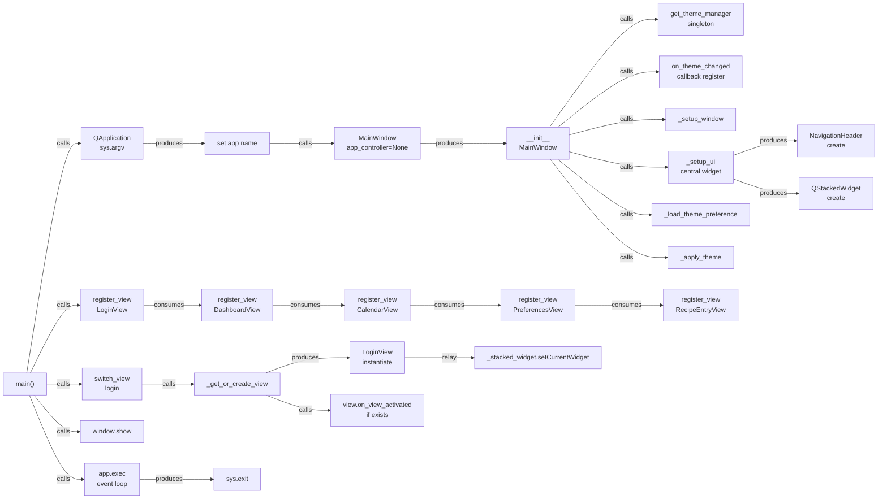

# Ground Truth — Client_Side/ui_new/run_ui.py

**Diagram type:** flowchart LR — Linear startup sequence showing QApplication instantiation, MainWindow initialization with theme manager loading, view registration, and then sequential view activation and display.

**Key files read:** Client_Side/ui_new/run_ui.py, Client_Side/ui_new/main_window.py, Client_Side/ui_new/views/__init__.py, Client_Side/ui_new/components/__init__.py, Client_Side/ui_new/components/navigation_header.py, Client_Side/ui_new/styles/theme_manager.py

**Nodes:** main, QApplication, set app name, MainWindow, __init__ MainWindow, get_theme_manager, on_theme_changed callback register, _setup_window, _setup_ui central widget, NavigationHeader create, QStackedWidget create, _load_theme_preference, _apply_theme, register_view LoginView, register_view DashboardView, register_view CalendarView, register_view PreferencesView, register_view RecipeEntryView, switch_view login, _get_or_create_view, LoginView instantiate, _stacked_widget.setCurrentWidget, view.on_view_activated if exists, window.show, app.exec event loop, sys.exit

**Edges:**
- main --calls--> QApplication
- QApplication --produces--> set app name
- set app name --calls--> MainWindow
- MainWindow --produces--> __init__ MainWindow
- __init__ MainWindow --calls--> get_theme_manager
- __init__ MainWindow --calls--> on_theme_changed callback register
- __init__ MainWindow --calls--> _setup_window
- __init__ MainWindow --calls--> _setup_ui central widget
- _setup_ui central widget --produces--> NavigationHeader create
- _setup_ui central widget --produces--> QStackedWidget create
- __init__ MainWindow --calls--> _load_theme_preference
- __init__ MainWindow --calls--> _apply_theme
- main --calls--> register_view LoginView
- register_view LoginView --consumes--> register_view DashboardView
- register_view DashboardView --consumes--> register_view CalendarView
- register_view CalendarView --consumes--> register_view PreferencesView
- register_view PreferencesView --consumes--> register_view RecipeEntryView
- main --calls--> switch_view login
- switch_view login --calls--> _get_or_create_view
- _get_or_create_view --produces--> LoginView instantiate
- LoginView instantiate --relay--> _stacked_widget.setCurrentWidget
- _get_or_create_view --calls--> view.on_view_activated if exists
- main --calls--> window.show
- main --calls--> app.exec event loop
- app.exec event loop --produces--> sys.exit
