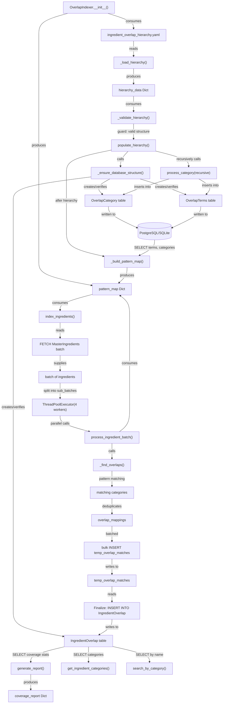

# Ground Truth — Server_Side/db/overlap_indexer.py

**Diagram type:** flowchart TB — Top-down pipeline with clear sequential stages, parallel processing branch, and decision guards; matches hierarchical ingredient processing from YAML through database to coverage reporting.

**Key files read:** Server_Side/db/overlap_indexer.py, Server_Side/db/db_factory.py, Server_Side/db/pg_database_utility.py

**Nodes:** OverlapIndexer.__init__(), ingredient_overlap_hierarchy.yaml, _load_hierarchy(), _validate_hierarchy(), populate_hierarchy(), _ensure_database_structure(), OverlapCategory (table), OverlapTerms (table), process_category(recursive), IngredientOverlap (table), _build_pattern_map(), pattern_map, index_ingredients(), MasterIngredients, ThreadPoolExecutor(4), process_ingredient_batch(), _find_overlaps(), Mappings, temp_overlap_matches, Finalize, generate_report(), coverage_report, get_ingredient_categories(), search_by_category(), PostgreSQL/SQLite DB

**Edges:**
- YAML --reads--> _load_hierarchy()
- _load_hierarchy() --produces--> hierarchy_data
- hierarchy_data --consumes--> _validate_hierarchy()
- _validate_hierarchy() --guard:valid--> populate_hierarchy()
- populate_hierarchy() --calls--> _ensure_database_structure()
- _ensure_database_structure() --creates--> OverlapCategory
- _ensure_database_structure() --creates--> OverlapTerms
- _ensure_database_structure() --creates--> IngredientOverlap
- populate_hierarchy() --recursively-calls--> process_category()
- process_category() --inserts--> OverlapCategory
- process_category() --inserts--> OverlapTerms
- populate_hierarchy() --calls--> _build_pattern_map()
- _build_pattern_map() --SELECT--> OverlapTerms
- _build_pattern_map() --produces--> pattern_map
- index_ingredients() --consumes--> pattern_map
- index_ingredients() --SELECT--> MasterIngredients
- index_ingredients() --parallelize--> ThreadPoolExecutor(4)
- ThreadPoolExecutor() --calls--> process_ingredient_batch()
- process_ingredient_batch() --calls--> _find_overlaps()
- process_ingredient_batch() --produces--> Mappings
- Mappings --batched-INSERT--> temp_overlap_matches
- temp_overlap_matches --SELECT--> Finalize
- Finalize --INSERT--> IngredientOverlap
- IngredientOverlap --SELECT--> generate_report()
- IngredientOverlap --SELECT--> get_ingredient_categories()
- IngredientOverlap --SELECT--> search_by_category()
