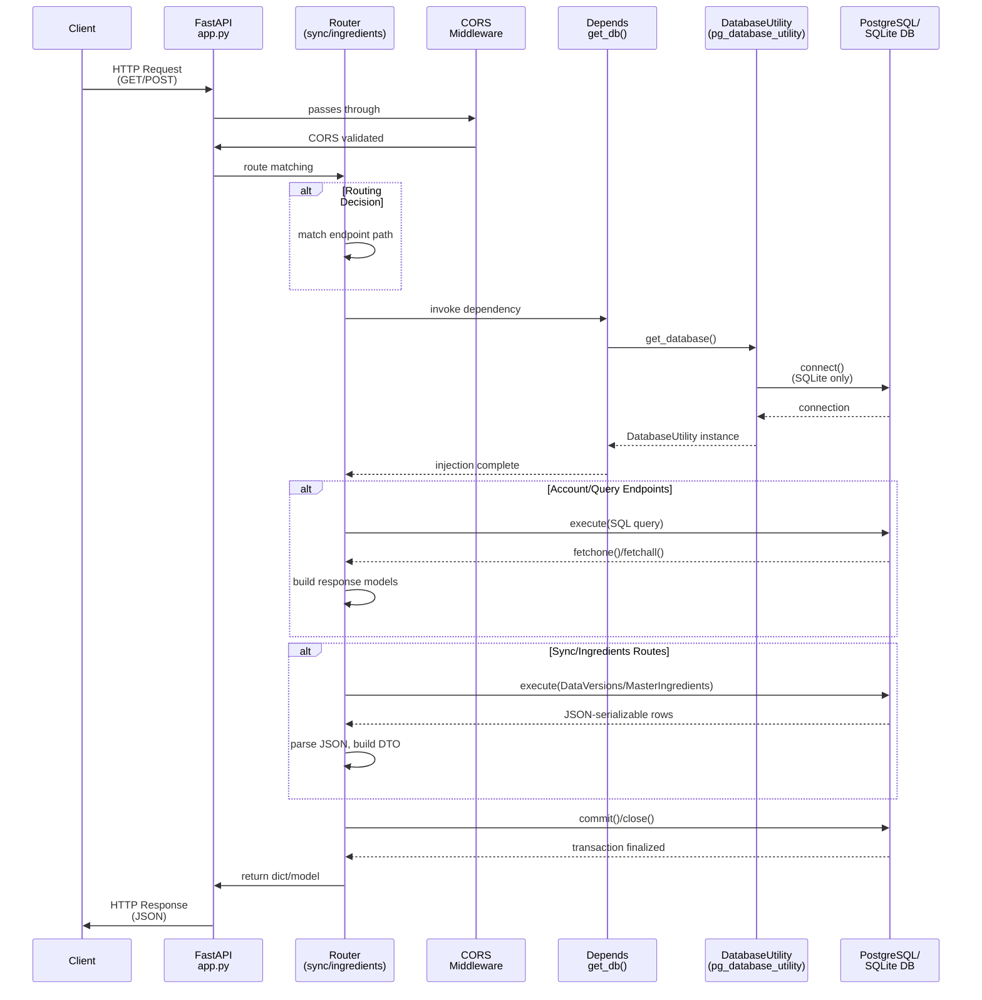

# Ground Truth — Server_Side/api/app.py

**Diagram type:** sequenceDiagram — Shows temporal flow of HTTP request through FastAPI routing, dependency injection, database operations, and response serialization.

**Key files read:** Server_Side/api/app.py, Server_Side/api/routes/sync.py, Server_Side/api/routes/ingredients.py, Server_Side/db/database_utility.py

**Nodes:** Client, FastAPI app.py, Router (sync/ingredients), CORS Middleware, Depends (get_db), DatabaseUtility, PostgreSQL/SQLite DB

**Edges:**
- Client --HTTP GET/POST--> FastAPI
- FastAPI --passes through--> CORS Middleware
- CORS Middleware --CORS validated--> FastAPI
- FastAPI --route matching--> Router
- Router --dependency invoke--> Depends
- Depends --get_database()--> DatabaseUtility
- DatabaseUtility --connect(SQLite only)--> Database
- Database --connection--> DatabaseUtility
- DatabaseUtility --injection complete--> Depends
- Depends --return instance--> Router
- Router --execute(SQL)--> Database
- Database --fetchone()/fetchall()--> Router
- Router --build response models--> Router
- Router --commit()/close()--> Database
- Database --transaction finalized--> Router
- Router --return dict/model--> FastAPI
- FastAPI --HTTP Response (JSON)--> Client
