# Ground Truth — Server_Side/main.py

**Diagram type:** flowchart LR with subgraphs — A linear 10-step sequential pipeline with conditional circuit-breaker guards on each transition naturally groups into 3 phases (Initialization, Data Loading, Finalization). Subgraphs clarify logical groupings and the left-to-right flow emphasizes step progression.

**Key files read:** Server_Side/main.py, Server_Side/db/db_factory.py, Server_Side/db/pg_database_utility.py, Server_Side/db/create_tables_pg.py

```mermaid
flowchart LR
    Start([Start: main]) --> Setup["setup_logging<br/>setup_directories"]
    Setup --> Init["Init Database<br/>get_database<br/>PostgresDatabaseUtility"]

    subgraph Phase1["PHASE 1: Schema Setup"]
        Init --> Step1["Step 1<br/>create_database_tables<br/>create_tables_postgresql<br/>+ indexes"]
        Step1 --> SeasonalBucket["insert_seasonal_buckets<br/>13 buckets"]
        SeasonalBucket --> Commit1["commit + close"]
    end

    subgraph Phase2["PHASE 2: Core Data Loading"]
        Commit1 --> Guard1{success?}
        Guard1 -->|false| Fail["Failure<br/>sys.exit(1)"]
        Guard1 -->|true| Step2["Step 2<br/>step2_import_data<br/>validate_data_files<br/>MasterIngredientsLoader<br/>+ report"]

        Step2 --> Guard2{success?}
        Guard2 -->|false| Fail
        Guard2 -->|true| Step2B["Step 2B<br/>step2b_load_climate_ingredients<br/>ClimateIngredientsLoader<br/>optional, non-critical"]

        Step2B --> Guard3{success?}
        Guard3 -->|false| Fail
        Guard3 -->|true| Step3["Step 3<br/>step3_index_allergens<br/>AllergenIndexer<br/>populate_allergen_hierarchy<br/>+ index_allergens"]

        Step3 --> Guard4{success?}
        Guard4 -->|false| Fail
        Guard4 -->|true| Step4["Step 4<br/>step4_index_ingredient_overlap<br/>OverlapIndexer<br/>populate_hierarchy<br/>+ index_ingredients"]

        Step4 --> Guard5{success?}
        Guard5 -->|false| Fail
        Guard5 -->|true| Step6["Step 6<br/>step6_load_lookup_tables<br/>LookupLoader<br/>MealCategory, DietType,<br/>Storage, Equipment"]

        Step6 --> Guard6{success?}
        Guard6 -->|false| Fail
        Guard6 -->|true| Step7["Step 7<br/>step7_load_cuisine_hierarchy<br/>CuisineHierarchyLoader<br/>cuisines_data.json"]

        Step7 --> Guard7{success?}
        Guard7 -->|false| Fail
        Guard7 -->|true| Step8["Step 8<br/>step8_load_taxonomy<br/>TaxonomyLoader<br/>agricultural_taxonomy.yaml"]
    end

    subgraph Phase3["PHASE 3: Recipe & Finalization"]
        Step8 --> Guard8{success?}
        Guard8 -->|false| Fail
        Guard8 -->|true| Step9["Step 9<br/>step9_import_recipes<br/>RecipeBatchImporter<br/>all_seeded_recipes.json<br/>+ load_reference_data"]

        Step9 --> Guard9{success?}
        Guard9 -->|false| Fail
        Guard9 -->|true| Step10["Step 10<br/>step10_derive_dietary_restrictions<br/>DietaryRestrictionDeriver<br/>derive_restrictions"]

        Step10 --> Guard10{success?}
        Guard10 -->|false| Fail
        Guard10 -->|true| Report["generate_completion_report<br/>database statistics<br/>grouped by system"]
    end

    Report --> Success["SUCCESS<br/>Database setup complete"]
    Fail --> Cleanup["finally: db_util.close"]
    Success --> Cleanup
    Cleanup --> End([Exit])
```

**Nodes:** Start, setup_logging, setup_directories, Init Database, Step 1 (create_database_tables), insert_seasonal_buckets, commit+close, Step 2 (import_data), Step 2B (climate_ingredients), Step 3 (allergens), Step 4 (overlap), Step 6 (lookup_tables), Step 7 (cuisine_hierarchy), Step 8 (taxonomy), Step 9 (recipes), Step 10 (dietary_restrictions), generate_completion_report, SUCCESS, FAILURE, Cleanup, Exit

**Edges:**
- Start --calls--> setup_logging
- setup_logging --calls--> setup_directories
- setup_directories --calls--> get_database (PostgresDatabaseUtility)
- get_database --consumes--> PostgresDatabaseUtility
- PostgresDatabaseUtility --produces--> db_util
- db_util --passed-to--> step1_create_database_tables
- step1_create_database_tables --calls--> create_tables_postgresql
- Step 1 --calls--> insert_seasonal_buckets
- Step 1 --calls--> commit + close
- Step 1 --guards--> Guard1 (success check)
- Guard1 --|success=true|--> Step 2 (step2_import_data)
- Guard1 --|success=false|--> FAILURE
- Step 2 --calls--> validate_data_files
- Step 2 --calls--> MasterIngredientsLoader
- Step 2 --guards--> Guard2
- Guard2 --|success=true|--> Step 2B (climate_ingredients)
- Guard2 --|success=false|--> FAILURE
- Step 2B --calls--> ClimateIngredientsLoader
- Step 2B --guards--> Guard3
- Guard3 --|true|--> Step 3
- Step 3 --calls--> AllergenIndexer
- Step 3 --guards--> Guard4
- Guard4 --|success=true|--> Step 4
- Step 4 --calls--> OverlapIndexer
- Step 4 --guards--> Guard5
- Guard5 --|success=true|--> Step 6
- Step 6 --calls--> LookupLoader
- Step 6 --guards--> Guard6
- Guard6 --|success=true|--> Step 7
- Step 7 --calls--> CuisineHierarchyLoader
- Step 7 --guards--> Guard7
- Guard7 --|success=true|--> Step 8
- Step 8 --calls--> TaxonomyLoader
- Step 8 --guards--> Guard8
- Guard8 --|success=true|--> Step 9
- Step 9 --calls--> RecipeBatchImporter
- Step 9 --guards--> Guard9
- Guard9 --|success=true|--> Step 10
- Step 10 --calls--> DietaryRestrictionDeriver
- Step 10 --guards--> Guard10
- Guard10 --|success=true|--> generate_completion_report
- generate_completion_report --produces--> SUCCESS
- FAILURE --transitions--> Cleanup
- SUCCESS --transitions--> Cleanup
- Cleanup --calls--> db_util.close
- Cleanup --transitions--> Exit
