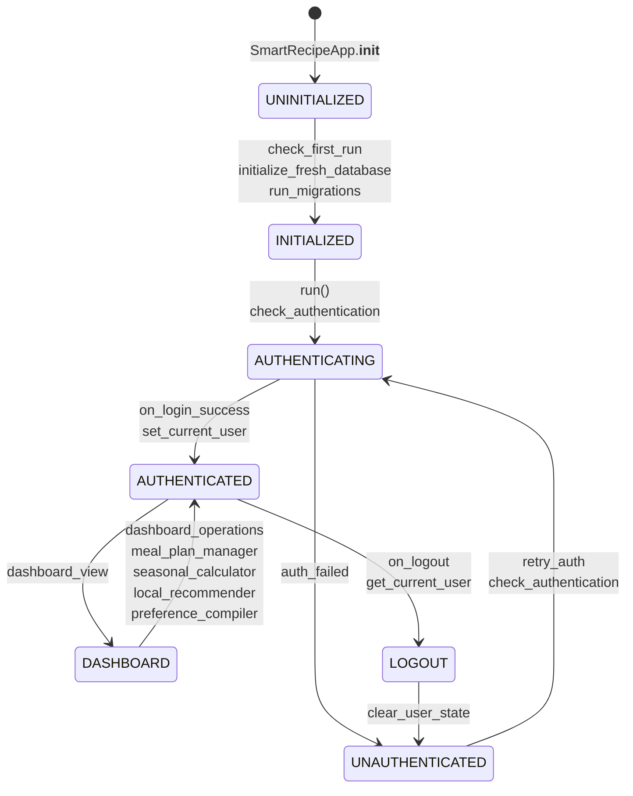

# Skill Output — Client_Side/main.py

**Diagram type:** stateDiagram-v2 — Represents SmartRecipeApp authentication state machine with transitions between UNINITIALIZED, AUTHENTICATING, AUTHENTICATED, and UNAUTHENTICATED states

**Graph files read:** toc.json, sub/main_Client_Side_main.json

**Nodes:** UNINITIALIZED, INITIALIZED, AUTHENTICATING, AUTHENTICATED, UNAUTHENTICATED, DASHBOARD, LOGOUT

**Edges:**
- SmartRecipeApp.__init__ --calls--> check_first_run
- check_first_run --calls--> initialize_fresh_database
- check_first_run --calls--> run_migrations
- SmartRecipeApp.run --calls--> check_authentication
- check_authentication --produces--> AUTHENTICATED_state or UNAUTHENTICATED_state
- on_login_success --calls--> set_current_user
- on_logout --calls--> get_current_user (clear state)
- SmartRecipeApp --contains--> on_login_success
- SmartRecipeApp --contains--> on_logout
- SmartRecipeApp.run --contains--> check_authentication
- SmartRecipeApp.__init__ --contains--> check_first_run
