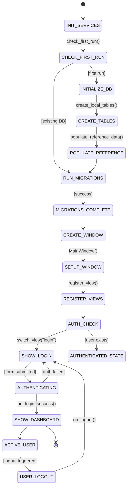

# Skill Output v2 — Client_Side/main.py

**Diagram type:** stateDiagram-v2 — Shows SmartRecipeApp initialization, database setup, authentication check, and login/logout state transitions driven by function calls in main.py

**Graph files read:** sub/main_Client_Side_main.json, tier_symbol.json

**Nodes:** INIT_SERVICES, CHECK_FIRST_RUN, INITIALIZE_DB, RUN_MIGRATIONS, CREATE_TABLES, POPULATE_REFERENCE, MIGRATIONS_COMPLETE, CREATE_WINDOW, SETUP_WINDOW, REGISTER_VIEWS, AUTH_CHECK, SHOW_LOGIN, AUTHENTICATED_STATE, AUTHENTICATING, SHOW_DASHBOARD, ACTIVE_USER, USER_LOGOUT

**Edges:**
- INIT_SERVICES --check_first_run()--> CHECK_FIRST_RUN
- CHECK_FIRST_RUN --initialize_fresh_database()--> INITIALIZE_DB
- CHECK_FIRST_RUN --run_migrations()--> RUN_MIGRATIONS
- INITIALIZE_DB --create_local_tables()--> CREATE_TABLES
- CREATE_TABLES --populate_reference_data()--> POPULATE_REFERENCE
- POPULATE_REFERENCE --> RUN_MIGRATIONS
- RUN_MIGRATIONS --> MIGRATIONS_COMPLETE
- MIGRATIONS_COMPLETE --> CREATE_WINDOW
- CREATE_WINDOW --MainWindow()--> SETUP_WINDOW
- SETUP_WINDOW --register_view()--> REGISTER_VIEWS
- REGISTER_VIEWS --check_authentication()--> AUTH_CHECK
- AUTH_CHECK --switch_view(login)--> SHOW_LOGIN
- AUTH_CHECK --[user exists]--> AUTHENTICATED_STATE
- SHOW_LOGIN --[form submitted]--> AUTHENTICATING
- AUTHENTICATING --on_login_success()--> SHOW_DASHBOARD
- AUTHENTICATING --[auth failed]--> SHOW_LOGIN
- SHOW_DASHBOARD --> ACTIVE_USER
- ACTIVE_USER --[logout triggered]--> USER_LOGOUT
- USER_LOGOUT --on_logout()--> SHOW_LOGIN
