# Skill Output v3 — Client_Side/main.py

**Diagram type:** stateDiagram-v2 — Full initialization, authentication, first-run, login, and view routing state machine for SmartRecipeApp.

**Graph files read:**
- CodeGrapher/graphs/sub/main_Client_Side_main.json
- CodeGrapher/graphs/tier_symbol.json

**Files traversed:**
- Client_Side/main.py
- Client_Side/ui_new/main_window.py
- Client_Side/ui_new/views/login_view.py
- Client_Side/utils/server_client.py

```mermaid
stateDiagram-v2
    [*] --> UNINITIALIZED: main() entry

    UNINITIALIZED --> CONFIG_LOAD: SmartRecipeApp.__init__()

    CONFIG_LOAD --> LOGGER_INIT: ConfigManager loaded
    LOGGER_INIT --> FIRST_RUN_CHECK: setup_logging(), get_logger()

    FIRST_RUN_CHECK --> DB_EXISTS: check_first_run() [db_path exists?]
    FIRST_RUN_CHECK --> DB_CREATE: [db_path does not exist]

    DB_CREATE --> CREATE_TABLES: initialize_fresh_database()
    CREATE_TABLES --> POPULATE_REF_DATA: create_local_tables()
    POPULATE_REF_DATA --> DB_MIGRATE: ReferenceDataPopulator.populate_all_reference_data()

    DB_EXISTS --> DB_MIGRATE: [db exists, skip init]

    DB_MIGRATE --> RUN_MIGRATIONS: run_migrations()
    RUN_MIGRATIONS --> MANAGER_INIT: migrate_shopping_lists(), migrate_add_meal_pattern()

    MANAGER_INIT --> DB_MGR_INIT: LocalDatabaseManager(db_path)
    DB_MGR_INIT --> SERVER_CLIENT_INIT: get_database_manager()

    SERVER_CLIENT_INIT --> SERVICES_READY: ServerClient(server_url, timeout)
    SERVICES_READY --> APP_RUN: SmartRecipeApp.run()

    APP_RUN --> CREATE_QAPP: QApplication(sys.argv)
    CREATE_QAPP --> WINDOW_CREATE: MainWindow(app_controller=self)

    WINDOW_CREATE --> VIEW_REGISTER: _setup_ui(), _setup_window()
    VIEW_REGISTER --> REG_LOGIN: main_window.register_view("login", LoginView)
    REG_LOGIN --> REG_DASHBOARD: register_view("dashboard", DashboardView)
    REG_DASHBOARD --> REG_CALENDAR: register_view("calendar", CalendarView)
    REG_CALENDAR --> REG_PREFS: register_view("preferences", AutofillPreferencesView)
    REG_PREFS --> REG_RECIPE: register_view("recipe_entry", RecipeEntryView)
    REG_RECIPE --> REG_SETTINGS: register_view("settings", SettingsView)

    REG_SETTINGS --> AUTH_CHECK: check_authentication()

    AUTH_CHECK --> SESSION_LOAD: get("last_household_id"), get("last_user_id")
    SESSION_LOAD --> SESSION_EXISTS: [saved session found?]
    SESSION_LOAD --> SHOW_LOGIN: [no saved session]

    SESSION_EXISTS --> HOUSEHOLD_VERIFY: get_all_households()
    HOUSEHOLD_VERIFY --> SESSION_VALID: [household exists]
    HOUSEHOLD_VERIFY --> SHOW_LOGIN: [household not found]

    SESSION_VALID --> SET_CONTEXT: [restore household_id, user_id, is_authenticated=True]
    SET_CONTEXT --> VIEW_SWITCH_DASH: switch_view("dashboard")

    SHOW_LOGIN --> UNAUTHENTICATED: is_authenticated=False
    UNAUTHENTICATED --> VIEW_SWITCH_LOGIN: switch_view("login")

    VIEW_SWITCH_LOGIN --> GET_OR_CREATE_LOGIN: _get_or_create_view("login")
    GET_OR_CREATE_LOGIN --> LAZY_INSTANTIATE_LOGIN: LoginView(app_controller=self)
    LAZY_INSTANTIATE_LOGIN --> LOGIN_SETUP_UI: _setup_ui()
    LOGIN_SETUP_UI --> CHECK_FIRST_RUN_LOGIN: QTimer.singleShot(100, _check_first_run)

    CHECK_FIRST_RUN_LOGIN --> GET_HOUSEHOLDS: get_all_households()
    GET_HOUSEHOLDS --> FIRST_RUN_BRANCH: [no households?]
    GET_HOUSEHOLDS --> AWAIT_LOGIN: [households exist]

    FIRST_RUN_BRANCH --> AUTO_CREATE_HOUSEHOLD: _auto_create_default_household()
    AUTO_CREATE_HOUSEHOLD --> GEN_UUID: str(uuid.uuid4())
    GEN_UUID --> CREATE_HH_WITH_ADMIN: db_manager.create_household_with_admin()

    CREATE_HH_WITH_ADMIN --> INIT_SEASONAL: SeasonalCalculator.initialize_for_household()
    INIT_SEASONAL --> CONNECT_SERVER: check_health() [server available?]

    CONNECT_SERVER --> CREATE_ANON_ACCT: create_anonymous_account()
    CREATE_ANON_ACCT --> SAVE_SERVER_ID: save_server_account_id()
    CONNECT_SERVER --> OFFLINE_MODE: [server not available]

    SAVE_SERVER_ID --> FORM_PREFILLED: setText(household_uuid, password)
    OFFLINE_MODE --> FORM_PREFILLED

    FORM_PREFILLED --> AWAIT_LOGIN: _login_button.setFocus()

    AWAIT_LOGIN --> MANUAL_LOGIN: [user clicks Login button or presses Enter]

    MANUAL_LOGIN --> LOGIN_EXTRACT: _handle_login()
    LOGIN_EXTRACT --> EXTRACT_FIELDS: getText(household_id, password)
    EXTRACT_FIELDS --> VALIDATE_LOGIN: [fields non-empty?]
    EXTRACT_FIELDS --> LOGIN_ERROR: [empty fields]

    VALIDATE_LOGIN --> AUTHENTICATING: authenticate_household(household_id, password)
    VALIDATE_LOGIN --> LOGIN_ERROR: [validation failed]

    AUTHENTICATING --> AUTH_RESULT: db_manager.authenticate_household()
    AUTH_RESULT --> AUTH_SUCCESS: [auth_result is truthy]
    AUTH_RESULT --> AUTH_FAILURE: [auth_result is falsy]

    AUTH_SUCCESS --> GET_SERVER_ID: get_server_account_id(household_db_id)
    GET_SERVER_ID --> SET_ACCOUNT: set_account_id(server_account_id)
    SET_ACCOUNT --> LOAD_SERVER_ID: [server_account_id exists]
    SET_ACCOUNT --> EMIT_SIGNAL: [no server account]

    LOAD_SERVER_ID --> SYNC_TOKEN: get_token_balance(server_account_id)
    SYNC_TOKEN --> UPDATE_BALANCE: update_token_balance(household_db_id, balance)
    UPDATE_BALANCE --> EMIT_SIGNAL: [balance synced]

    EMIT_SIGNAL --> LOGIN_SUCCESS_SIGNAL: login_successful.emit(household_db_id, user_id)
    LOGIN_SUCCESS_SIGNAL --> CALL_ON_SUCCESS: on_login_success(household_db_id, user_id)

    CALL_ON_SUCCESS --> SET_HH_ID: set_household_id(household_id)
    SET_HH_ID --> SET_USER_ID: set_current_user(user_id)
    SET_USER_ID --> SET_AUTH_FLAG: is_authenticated=True
    SET_AUTH_FLAG --> SAVE_SESSION: config_manager.set("last_household_id", household_id)
    SAVE_SESSION --> SAVE_USER_SESSION: config_manager.set("last_user_id", user_id)
    SAVE_USER_SESSION --> ON_LOGIN_SUCCESS: [app_controller.on_login_success()]

    ON_LOGIN_SUCCESS --> VIEW_SWITCH_DASH: switch_view("dashboard")

    VIEW_SWITCH_DASH --> GET_OR_CREATE_DASH: _get_or_create_view("dashboard")
    GET_OR_CREATE_DASH --> LAZY_INSTANTIATE_DASH: DashboardView(app_controller=self)
    LAZY_INSTANTIATE_DASH --> VIEW_DISPLAY: _stacked_widget.setCurrentWidget(view)

    VIEW_DISPLAY --> VIEW_ACTIVATED: [view.on_view_activated() called if exists]
    VIEW_ACTIVATED --> APP_MAIN_LOOP: sys.exit(app.exec())

    AUTH_FAILURE --> LOGIN_ERROR: "Invalid Household ID or Password"
    LOGIN_ERROR --> SHOW_STATUS: _show_status(error_msg, "error")
    SHOW_STATUS --> AWAIT_LOGIN: [user can retry]

    APP_MAIN_LOOP --> LOGOUT_HANDLER: [user clicks logout or event triggered]
    LOGOUT_HANDLER --> ON_LOGOUT: on_logout()

    ON_LOGOUT --> CLEAR_HH: current_household_id=None
    CLEAR_HH --> CLEAR_USER: current_user_id=None
    CLEAR_USER --> CLEAR_AUTH: is_authenticated=False
    CLEAR_AUTH --> CLEAR_SESSION_HH: config_manager.set("last_household_id", None)
    CLEAR_SESSION_HH --> CLEAR_SESSION_USER: config_manager.set("last_user_id", None)
    CLEAR_SESSION_USER --> VIEW_SWITCH_LOGIN: switch_view("login")
```

**Nodes:** UNINITIALIZED, CONFIG_LOAD, LOGGER_INIT, FIRST_RUN_CHECK, DB_EXISTS, DB_CREATE, CREATE_TABLES, POPULATE_REF_DATA, DB_MIGRATE, RUN_MIGRATIONS, MANAGER_INIT, DB_MGR_INIT, SERVER_CLIENT_INIT, SERVICES_READY, APP_RUN, CREATE_QAPP, WINDOW_CREATE, VIEW_REGISTER, REG_LOGIN, REG_DASHBOARD, REG_CALENDAR, REG_PREFS, REG_RECIPE, REG_SETTINGS, AUTH_CHECK, SESSION_LOAD, SESSION_EXISTS, SHOW_LOGIN, HOUSEHOLD_VERIFY, SESSION_VALID, SET_CONTEXT, VIEW_SWITCH_DASH, UNAUTHENTICATED, VIEW_SWITCH_LOGIN, GET_OR_CREATE_LOGIN, LAZY_INSTANTIATE_LOGIN, LOGIN_SETUP_UI, CHECK_FIRST_RUN_LOGIN, GET_HOUSEHOLDS, FIRST_RUN_BRANCH, AWAIT_LOGIN, AUTO_CREATE_HOUSEHOLD, GEN_UUID, CREATE_HH_WITH_ADMIN, INIT_SEASONAL, CONNECT_SERVER, CREATE_ANON_ACCT, SAVE_SERVER_ID, OFFLINE_MODE, FORM_PREFILLED, MANUAL_LOGIN, LOGIN_EXTRACT, EXTRACT_FIELDS, VALIDATE_LOGIN, LOGIN_ERROR, AUTHENTICATING, AUTH_RESULT, AUTH_SUCCESS, AUTH_FAILURE, GET_SERVER_ID, SET_ACCOUNT, LOAD_SERVER_ID, EMIT_SIGNAL, SYNC_TOKEN, UPDATE_BALANCE, LOGIN_SUCCESS_SIGNAL, CALL_ON_SUCCESS, SET_HH_ID, SET_USER_ID, SET_AUTH_FLAG, SAVE_SESSION, SAVE_USER_SESSION, ON_LOGIN_SUCCESS, GET_OR_CREATE_DASH, LAZY_INSTANTIATE_DASH, VIEW_DISPLAY, VIEW_ACTIVATED, APP_MAIN_LOOP, LOGOUT_HANDLER, ON_LOGOUT, CLEAR_HH, CLEAR_USER, CLEAR_AUTH, CLEAR_SESSION_HH, CLEAR_SESSION_USER, SHOW_STATUS

**Edges:**
- UNINITIALIZED --> CONFIG_LOAD (SmartRecipeApp.__init__())
- CONFIG_LOAD --> LOGGER_INIT (ConfigManager loaded)
- LOGGER_INIT --> FIRST_RUN_CHECK (setup_logging, get_logger)
- FIRST_RUN_CHECK --> DB_EXISTS ([db_path exists])
- FIRST_RUN_CHECK --> DB_CREATE ([db_path does not exist])
- DB_CREATE --> CREATE_TABLES (initialize_fresh_database)
- CREATE_TABLES --> POPULATE_REF_DATA (create_local_tables)
- POPULATE_REF_DATA --> DB_MIGRATE (populate_all_reference_data)
- DB_EXISTS --> DB_MIGRATE ([db exists])
- DB_MIGRATE --> RUN_MIGRATIONS (run_migrations)
- RUN_MIGRATIONS --> MANAGER_INIT (migrations complete)
- MANAGER_INIT --> DB_MGR_INIT (LocalDatabaseManager init)
- DB_MGR_INIT --> SERVER_CLIENT_INIT (get_database_manager)
- SERVER_CLIENT_INIT --> SERVICES_READY (ServerClient init)
- SERVICES_READY --> APP_RUN (SmartRecipeApp.run)
- APP_RUN --> CREATE_QAPP (QApplication created)
- CREATE_QAPP --> WINDOW_CREATE (MainWindow init)
- WINDOW_CREATE --> VIEW_REGISTER (register all views)
- VIEW_REGISTER --> REG_LOGIN (register login view)
- REG_LOGIN --> REG_DASHBOARD (register dashboard)
- REG_DASHBOARD --> REG_CALENDAR (register calendar)
- REG_CALENDAR --> REG_PREFS (register preferences)
- REG_PREFS --> REG_RECIPE (register recipe_entry)
- REG_RECIPE --> REG_SETTINGS (register settings)
- REG_SETTINGS --> AUTH_CHECK (check_authentication)
- AUTH_CHECK --> SESSION_LOAD (get saved session)
- SESSION_LOAD --> SESSION_EXISTS ([saved session exists])
- SESSION_LOAD --> SHOW_LOGIN ([no saved session])
- SESSION_EXISTS --> HOUSEHOLD_VERIFY (get_all_households)
- HOUSEHOLD_VERIFY --> SESSION_VALID ([household_id in households])
- HOUSEHOLD_VERIFY --> SHOW_LOGIN ([household not found])
- SESSION_VALID --> SET_CONTEXT (restore context)
- SET_CONTEXT --> VIEW_SWITCH_DASH (switch_view dashboard)
- SHOW_LOGIN --> UNAUTHENTICATED (is_authenticated=False)
- UNAUTHENTICATED --> VIEW_SWITCH_LOGIN (switch_view login)
- VIEW_SWITCH_LOGIN --> GET_OR_CREATE_LOGIN (_get_or_create_view)
- GET_OR_CREATE_LOGIN --> LAZY_INSTANTIATE_LOGIN (LoginView instantiate)
- LAZY_INSTANTIATE_LOGIN --> LOGIN_SETUP_UI (_setup_ui)
- LOGIN_SETUP_UI --> CHECK_FIRST_RUN_LOGIN (QTimer _check_first_run)
- CHECK_FIRST_RUN_LOGIN --> GET_HOUSEHOLDS (get_all_households)
- GET_HOUSEHOLDS --> FIRST_RUN_BRANCH ([no households])
- GET_HOUSEHOLDS --> AWAIT_LOGIN ([households exist])
- FIRST_RUN_BRANCH --> AUTO_CREATE_HOUSEHOLD (_auto_create_default_household)
- AUTO_CREATE_HOUSEHOLD --> GEN_UUID (str uuid4)
- GEN_UUID --> CREATE_HH_WITH_ADMIN (create_household_with_admin)
- CREATE_HH_WITH_ADMIN --> INIT_SEASONAL (SeasonalCalculator.initialize_for_household)
- INIT_SEASONAL --> CONNECT_SERVER (check_health)
- CONNECT_SERVER --> CREATE_ANON_ACCT ([server available])
- CREATE_ANON_ACCT --> SAVE_SERVER_ID (create_anonymous_account)
- SAVE_SERVER_ID --> FORM_PREFILLED (save_server_account_id)
- CONNECT_SERVER --> OFFLINE_MODE ([server unavailable])
- OFFLINE_MODE --> FORM_PREFILLED (offline mode)
- FORM_PREFILLED --> AWAIT_LOGIN (form auto-filled)
- AWAIT_LOGIN --> MANUAL_LOGIN ([user clicks Login])
- MANUAL_LOGIN --> LOGIN_EXTRACT (_handle_login)
- LOGIN_EXTRACT --> EXTRACT_FIELDS (getText)
- EXTRACT_FIELDS --> VALIDATE_LOGIN ([fields non-empty])
- EXTRACT_FIELDS --> LOGIN_ERROR ([empty fields])
- VALIDATE_LOGIN --> AUTHENTICATING (authenticate_household call)
- AUTHENTICATING --> AUTH_RESULT (db_manager.authenticate_household)
- AUTH_RESULT --> AUTH_SUCCESS ([auth_result truthy])
- AUTH_RESULT --> AUTH_FAILURE ([auth_result falsy])
- AUTH_SUCCESS --> GET_SERVER_ID (get_server_account_id)
- GET_SERVER_ID --> SET_ACCOUNT (set_account_id)
- SET_ACCOUNT --> LOAD_SERVER_ID ([server_account_id exists])
- SET_ACCOUNT --> EMIT_SIGNAL ([no server account])
- LOAD_SERVER_ID --> SYNC_TOKEN (get_token_balance)
- SYNC_TOKEN --> UPDATE_BALANCE (update_token_balance)
- UPDATE_BALANCE --> EMIT_SIGNAL (balance synced)
- EMIT_SIGNAL --> LOGIN_SUCCESS_SIGNAL (login_successful.emit)
- LOGIN_SUCCESS_SIGNAL --> CALL_ON_SUCCESS (on_login_success call)
- CALL_ON_SUCCESS --> SET_HH_ID (set_household_id)
- SET_HH_ID --> SET_USER_ID (set_current_user)
- SET_USER_ID --> SET_AUTH_FLAG (is_authenticated=True)
- SET_AUTH_FLAG --> SAVE_SESSION (config set last_household_id)
- SAVE_SESSION --> SAVE_USER_SESSION (config set last_user_id)
- SAVE_USER_SESSION --> ON_LOGIN_SUCCESS (on_login_success)
- ON_LOGIN_SUCCESS --> VIEW_SWITCH_DASH (switch_view dashboard)
- VIEW_SWITCH_DASH --> GET_OR_CREATE_DASH (_get_or_create_view dashboard)
- GET_OR_CREATE_DASH --> LAZY_INSTANTIATE_DASH (DashboardView instantiate)
- LAZY_INSTANTIATE_DASH --> VIEW_DISPLAY (setCurrentWidget)
- VIEW_DISPLAY --> VIEW_ACTIVATED (on_view_activated called)
- VIEW_ACTIVATED --> APP_MAIN_LOOP (app.exec)
- AUTH_FAILURE --> LOGIN_ERROR (auth failed)
- LOGIN_ERROR --> SHOW_STATUS (_show_status error)
- SHOW_STATUS --> AWAIT_LOGIN (retry login)
- APP_MAIN_LOOP --> LOGOUT_HANDLER (logout event)
- LOGOUT_HANDLER --> ON_LOGOUT (on_logout call)
- ON_LOGOUT --> CLEAR_HH (clear household_id)
- CLEAR_HH --> CLEAR_USER (clear user_id)
- CLEAR_USER --> CLEAR_AUTH (clear auth flag)
- CLEAR_AUTH --> CLEAR_SESSION_HH (clear saved household)
- CLEAR_SESSION_HH --> CLEAR_SESSION_USER (clear saved user)
- CLEAR_SESSION_USER --> VIEW_SWITCH_LOGIN (return to login)
