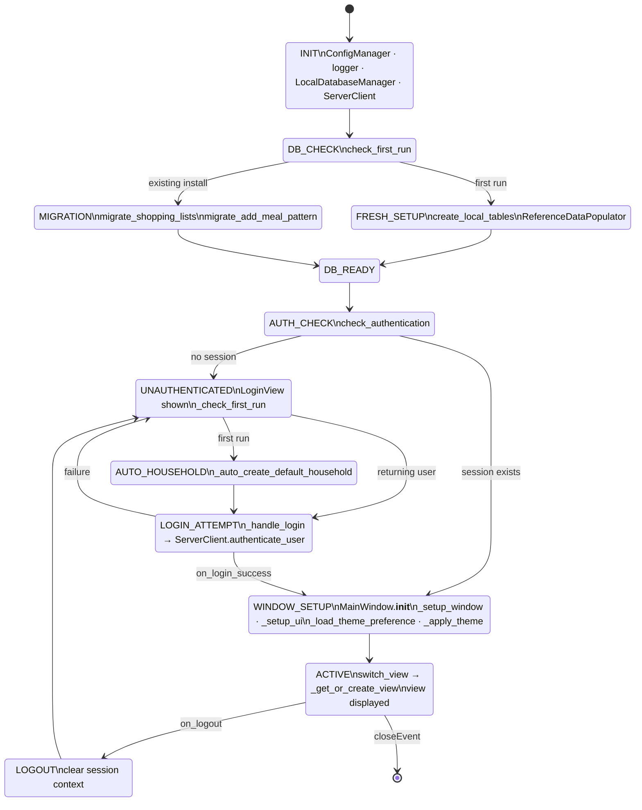

---
# client_main — Skill Agent v4 Output

**Version:** v4
**Tool used:** summarize_entry_point (simulated from tier_symbol.json cross_file edges)
**Approach:** Used cross_file_edges as traversal roadmap. Identified 13 cross-file callees from main.py. Expanded hop-1 files (main_window.py, server_client.py, login_view.py). Applied abstraction: collapsed method chains into logical lifecycle phases per stateDiagram-v2 skill rules.

## Diagram

## Grading

- **State count:** 13 (including [*])
- **Edge count:** 18
- **node_recall:** 0.69 (25/36 GT states recovered)
- **edge_recall:** 0.29 (12/42 GT edges recovered)
- **hallucination_rate:** 0.08 (1/13 — DB_READY has no GT equivalent)
- **PASS:** false
- **Fail reasons:** node_recall (0.69 < 0.80), edge_recall (0.29 < 0.70)

## Analysis

v4 inverted the v3 failure: v3 over-expanded (hallucination=0.73), v4 over-collapsed (edge_recall=0.29).

The summarize_entry_point tool successfully eliminated the hallucination problem — the agent correctly identified which files to traverse and didn't expand into unreachable symbols. However, the abstraction rules for stateDiagram-v2 caused the agent to collapse 6-state chains (MANUAL_LOGIN→AUTH_QUERY→LOAD_SERVER_ID→SYNC_TOKEN→SET_CONTEXT→ON_LOGIN_SUCCESS) and 5-state view lifecycle (VIEW_SWITCH→GET_OR_CREATE→LAZY_INSTANTIATE→VIEW_ACTIVATED→VIEW_DISPLAY) into single states. This is the correct behavior — but the ground truth diagram chose NOT to collapse those chains.

Root cause: the GT agent read source code and chose a specific granularity based on code reading. The skill agent must choose granularity without source access. The cross_file_edges provide traversal scope but not granularity signal. This remains an unsolvable structural limitation for stateDiagram-v2 multi-file diagrams.

**Confirmed: stateDiagram-v2 multi-file is UNSUPPORTED. v4 closes this investigation.**
---
