# Skill Output — Client_Side/ui_new/run_ui.py

**Diagram type:** flowchart LR — shows the linear startup call chain from run_ui.py::main() through QApplication creation, MainWindow initialization, view registration/switching, display, and event loop execution.

**Graph files read:** toc.json, tier_symbol.json

```mermaid
flowchart LR
    A["main()"] -->|calls seq:1| B["QApplication"]
    B -->|calls seq:2| C["setApplicationName"]
    C -->|calls seq:3| D["setApplicationDisplayName"]
    D -->|calls seq:4| E["MainWindow"]
    E -->|calls seq:5| F["register_view"]
    F -->|calls seq:10| G["switch_view"]
    G -->|calls seq:11| H["show"]
    H -->|calls seq:12| I["exit"]
    I -->|calls seq:13| J["exec"]
```

**Nodes:** main, QApplication, setApplicationName, setApplicationDisplayName, MainWindow, register_view, switch_view, show, exit, exec

**Edges:**
- main --calls--> QApplication
- QApplication --calls--> setApplicationName
- setApplicationName --calls--> setApplicationDisplayName
- setApplicationDisplayName --calls--> MainWindow
- MainWindow --calls--> register_view
- register_view --calls--> switch_view
- switch_view --calls--> show
- show --calls--> exit
- exit --calls--> exec
