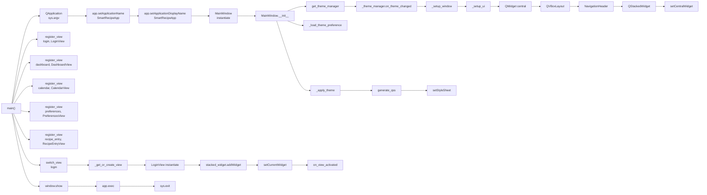

# Skill Output v2 — Client_Side/ui_new/run_ui.py

**Diagram type:** flowchart LR — Linear startup call chain from run_ui.py main() entry point through MainWindow initialization, view registration, and application launch

**Graph files read:** sub/main_Client_Side_ui_new_run_ui.json, tier_symbol.json

**Nodes:** main, QApplication, setApplicationName, setApplicationDisplayName, MainWindow, MainWindow.__init__, get_theme_manager, on_theme_changed, _setup_window, _setup_ui, QWidget, QVBoxLayout, NavigationHeader, QStackedWidget, setCentralWidget, _load_theme_preference, _apply_theme, generate_qss, setStyleSheet, register_view LoginView, register_view DashboardView, register_view CalendarView, register_view PreferencesView, register_view RecipeEntryView, switch_view, _get_or_create_view, LoginView instantiate, addWidget, setCurrentWidget, on_view_activated, window.show, app.exec, sys.exit

**Edges:**
- main --calls--> QApplication
- main --calls--> setApplicationName
- main --calls--> setApplicationDisplayName
- main --calls--> MainWindow
- MainWindow.__init__ --calls--> get_theme_manager
- MainWindow.__init__ --calls--> on_theme_changed
- MainWindow.__init__ --calls--> _setup_window
- MainWindow.__init__ --calls--> _setup_ui
- MainWindow.__init__ --calls--> _load_theme_preference
- MainWindow.__init__ --calls--> _apply_theme
- _setup_ui --calls--> QWidget
- _setup_ui --calls--> QVBoxLayout
- _setup_ui --calls--> NavigationHeader
- _setup_ui --calls--> QStackedWidget
- _setup_ui --calls--> setCentralWidget
- _apply_theme --calls--> generate_qss
- _apply_theme --calls--> setStyleSheet
- main --calls--> register_view (5x)
- main --calls--> switch_view
- switch_view --calls--> _get_or_create_view
- _get_or_create_view --calls--> LoginView instantiate
- _get_or_create_view --calls--> addWidget
- _get_or_create_view --calls--> setCurrentWidget
- switch_view --calls--> on_view_activated
- main --calls--> window.show
- main --calls--> app.exec
- main --calls--> sys.exit
