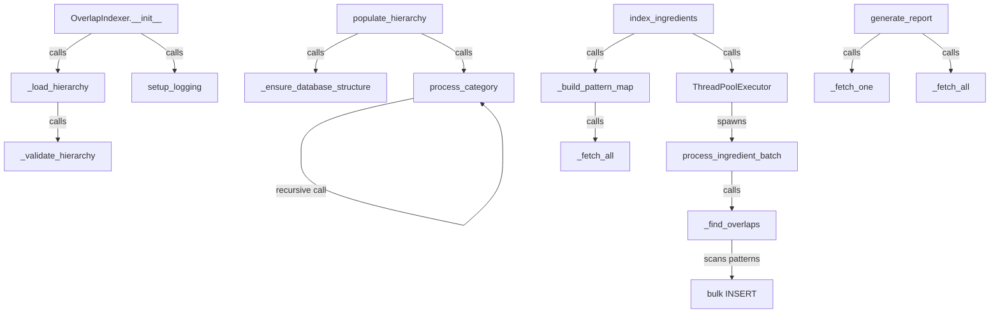

# Skill Output — Server_Side/db/overlap_indexer.py

**Diagram type:** flowchart TB — Pipeline execution showing OverlapIndexer initialization through hierarchy loading, validation, population, pattern mapping, ingredient indexing with thread pooling, overlap finding, and final reporting.

**Graph files read:** toc.json, tier_symbol.json

**Nodes:** OverlapIndexer.__init__, _load_hierarchy, _validate_hierarchy, setup_logging, populate_hierarchy, _ensure_database_structure, process_category, index_ingredients, _build_pattern_map, _fetch_all, ThreadPoolExecutor, process_ingredient_batch, _find_overlaps, bulk INSERT, generate_report, _fetch_one

**Edges:**
- OverlapIndexer.__init__ --calls--> _load_hierarchy
- OverlapIndexer.__init__ --calls--> setup_logging
- _load_hierarchy --calls--> _validate_hierarchy
- populate_hierarchy --calls--> _ensure_database_structure
- populate_hierarchy --calls--> process_category
- process_category --calls--> process_category (recursive)
- index_ingredients --calls--> _build_pattern_map
- _build_pattern_map --calls--> _fetch_all
- index_ingredients --calls--> ThreadPoolExecutor
- ThreadPoolExecutor --spawns--> process_ingredient_batch
- process_ingredient_batch --calls--> _find_overlaps
- _find_overlaps --scans--> bulk INSERT
- generate_report --calls--> _fetch_one
- generate_report --calls--> _fetch_all
