# Skill Output v2 — Server_Side/db/overlap_indexer.py

**Diagram type:** flowchart TB — Data pipeline for ingredient overlap indexing from YAML hierarchy through PostgreSQL database

**Graph files read:** tier_symbol.json

```mermaid
flowchart TB
    Start["main()"]

    YamlFile["ingredient_overlap_hierarchy.yaml"]
    Init["OverlapIndexer.__init__"]

    GetDb["get_database()"]
    DbConn["PostgresDatabaseUtility"]

    LoadHier["_load_hierarchy()"]
    ValidateHier["_validate_hierarchy()"]
    EnsureDbStruct["_ensure_database_structure()"]

    PopulateHier["populate_hierarchy()"]
    ProcessCat["process_category()"]

    OverlapCatTable["OverlapCategory (table)"]
    OverlapTermsTable["OverlapTerms (table)"]

    BuildPatternMap["_build_pattern_map()"]
    PatternMap["pattern_map (dict)"]

    IndexIngredients["index_ingredients()"]
    GetMasterIngreds["_fetch_one(MasterIngredients)"]
    MasterIngredientsTable["MasterIngredients (table)"]

    ProcessBatch["process_ingredient_batch()"]
    FindOverlaps["_find_overlaps()"]
    OverlapMappings["overlap_mappings (set)"]

    ThreadPool["ThreadPoolExecutor(4 workers)"]

    InsertOverlaps["INSERT IngredientOverlap"]
    IngredientOverlapTable["IngredientOverlap (table)"]

    GenerateReport["generate_report()"]
    CoverageReport["coverage_report (dict)"]

    GetCategories["get_ingredient_categories()"]
    SearchByCategory["search_by_category()"]

    Start -->|calls| Init
    YamlFile -->|read by| LoadHier

    Init -->|calls| GetDb
    GetDb -->|produces| DbConn
    Init -->|calls| LoadHier

    LoadHier -->|calls| ValidateHier
    ValidateHier -->|validates| YamlFile

    Init -->|calls| PopulateHier
    PopulateHier -->|calls| EnsureDbStruct
    EnsureDbStruct -->|creates| OverlapCatTable
    EnsureDbStruct -->|creates| OverlapTermsTable

    PopulateHier -->|calls| ProcessCat
    ProcessCat -->|inserts into| OverlapCatTable
    ProcessCat -->|inserts into| OverlapTermsTable

    IndexIngredients -->|calls| BuildPatternMap
    BuildPatternMap -->|queries| OverlapCatTable
    BuildPatternMap -->|produces| PatternMap

    IndexIngredients -->|calls| GetMasterIngreds
    GetMasterIngreds -->|reads| MasterIngredientsTable

    IndexIngredients -->|creates| ThreadPool
    ThreadPool -->|submits to| ProcessBatch

    ProcessBatch -->|calls| FindOverlaps
    FindOverlaps -->|uses| PatternMap
    FindOverlaps -->|produces| OverlapMappings

    IndexIngredients -->|inserts via| InsertOverlaps
    InsertOverlaps -->|writes to| IngredientOverlapTable

    GenerateReport -->|queries| MasterIngredientsTable
    GenerateReport -->|queries| IngredientOverlapTable
    GenerateReport -->|produces| CoverageReport

    GetCategories -->|queries| OverlapCatTable
    SearchByCategory -->|queries| IngredientOverlapTable

    Start -->|calls| PopulateHier
    Start -->|calls| IndexIngredients
    Start -->|calls| GenerateReport
```

**Nodes:** main, OverlapIndexer.__init__, get_database, PostgresDatabaseUtility, ingredient_overlap_hierarchy.yaml, _load_hierarchy, _validate_hierarchy, populate_hierarchy, _ensure_database_structure, process_category, OverlapCategory (table), OverlapTerms (table), _build_pattern_map, pattern_map, index_ingredients, _fetch_one (MasterIngredients), MasterIngredients (table), ThreadPoolExecutor (4 workers), process_ingredient_batch, _find_overlaps, overlap_mappings, INSERT IngredientOverlap, IngredientOverlap (table), generate_report, coverage_report, get_ingredient_categories, search_by_category

**Edges:**
- main --calls--> OverlapIndexer.__init__
- OverlapIndexer.__init__ --calls--> get_database
- get_database --produces--> PostgresDatabaseUtility
- OverlapIndexer.__init__ --calls--> _load_hierarchy
- _load_hierarchy --calls--> _validate_hierarchy
- _validate_hierarchy --validates--> ingredient_overlap_hierarchy.yaml
- populate_hierarchy --calls--> _ensure_database_structure
- _ensure_database_structure --creates--> OverlapCategory (table)
- _ensure_database_structure --creates--> OverlapTerms (table)
- populate_hierarchy --calls--> process_category
- process_category --inserts into--> OverlapCategory (table)
- process_category --inserts into--> OverlapTerms (table)
- index_ingredients --calls--> _build_pattern_map
- _build_pattern_map --queries--> OverlapCategory (table)
- _build_pattern_map --produces--> pattern_map
- index_ingredients --calls--> _fetch_one (MasterIngredients)
- _fetch_one --reads--> MasterIngredients (table)
- index_ingredients --creates--> ThreadPoolExecutor
- ThreadPoolExecutor --submits--> process_ingredient_batch
- process_ingredient_batch --calls--> _find_overlaps
- _find_overlaps --uses--> pattern_map
- _find_overlaps --produces--> overlap_mappings
- index_ingredients --inserts--> IngredientOverlap (table)
- generate_report --queries--> MasterIngredients (table)
- generate_report --queries--> IngredientOverlap (table)
- generate_report --produces--> coverage_report
- get_ingredient_categories --queries--> OverlapCategory (table)
- search_by_category --queries--> IngredientOverlap (table)
