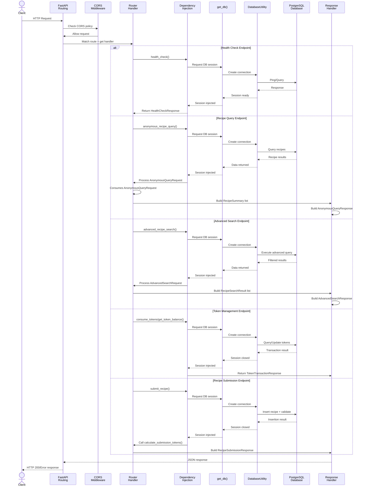

# Skill Output — Server_Side/api/app.py

**Diagram type:** sequenceDiagram — FastAPI request routing flow with dependency injection and database operations

**Graph files read:** toc.json, sub/main_Server_Side_api_app.json

**Nodes:** Client, FastAPI, CORS Middleware, Router Handler, Dependency Injection, get_db, DatabaseUtility, PostgreSQL Database, Response Handler, health_check, anonymous_recipe_query, advanced_recipe_search, consume_tokens, get_token_balance, submit_recipe, calculate_submission_tokens, HealthCheckResponse, AnonymousQueryRequest, AnonymousQueryResponse, RecipeSummary, AdvancedSearchRequest, AdvancedSearchResponse, RecipeSearchResult, TokenTransactionResponse, RecipeSubmissionRequest, RecipeSubmissionResponse

**Edges:**
- health_check --defines--> get_db
- get_db --calls--> DatabaseUtility.connect
- DatabaseUtility --calls--> PostgreSQL.query
- anonymous_recipe_query --consumes--> AnonymousQueryRequest
- anonymous_recipe_query --calls--> RecipeSummary
- advanced_recipe_search --consumes--> AdvancedSearchRequest
- advanced_recipe_search --calls--> AdvancedSearchResponse
- advanced_recipe_search --calls--> RecipeSearchResult
- consume_tokens --calls--> DatabaseUtility.update
- get_token_balance --calls--> DatabaseUtility.query
- submit_recipe --consumes--> RecipeSubmissionRequest
- submit_recipe --calls--> calculate_submission_tokens
- calculate_submission_tokens --consumes--> RecipeSubmissionRequest
