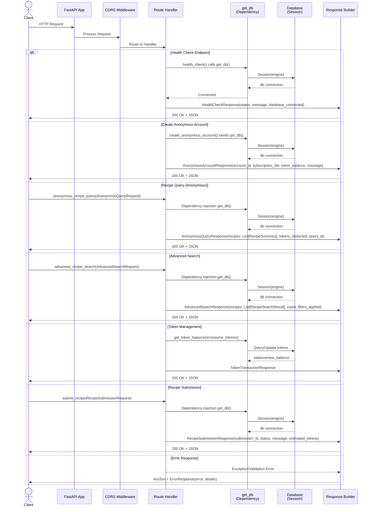

# Skill Output v2 — Server_Side/api/app.py

**Diagram type:** sequenceDiagram — Shows the complete request/response flow through FastAPI endpoints with multiple handler types interacting with database dependencies.

**Graph files read:** toc.json, sub/main_Server_Side_api_app.json

**Nodes:** Client, FastAPI App, CORS Middleware, Router Handler, get_db (Dependency), Database Session, Response Builder, health_check, create_anonymous_account, anonymous_recipe_query, advanced_recipe_search, get_token_balance, consume_tokens, submit_recipe, HealthCheckResponse, AnonymousAccountResponse, AnonymousQueryRequest, AnonymousQueryResponse, RecipeSummary, AdvancedSearchRequest, AdvancedSearchResponse, RecipeSearchResult, TokenTransactionResponse, RecipeSubmissionRequest, RecipeSubmissionResponse

**Edges:**
- Client --HTTP Request--> FastAPI
- FastAPI --Process Request--> CORS Middleware
- CORS Middleware --Route to Handler--> Router
- Router --calls get_db()--> GetDB
- GetDB --Session(engine)--> Database
- Database --connection--> GetDB
- GetDB --injection--> Router
- Router --return model--> Response
- Response --HTTP Response--> Client
- anonymous_recipe_query --consumes--> AnonymousQueryRequest
- anonymous_recipe_query --calls--> RecipeSummary
- advanced_recipe_search --consumes--> AdvancedSearchRequest
- advanced_recipe_search --calls--> AdvancedSearchResponse
- advanced_recipe_search --calls--> RecipeSearchResult
- submit_recipe --consumes--> RecipeSubmissionRequest
- submit_recipe --calls--> calculate_submission_tokens
