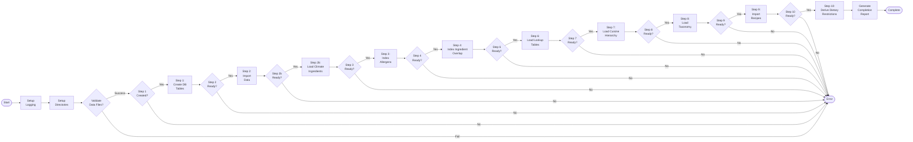

# Skill Output — Server_Side/main.py

**Diagram type:** flowchart LR — shows sequential database initialization pipeline with circuit-breaker guards (success checks) between each major stage

**Graph files read:** sub/main_Server_Side_main.json

**Nodes:** setup_logging, setup_directories, validate_data_files, step1_create_database_tables, step2_import_data, step2b_load_climate_ingredients, step3_index_allergens, step4_index_ingredient_overlap, step6_load_lookup_tables, step7_load_cuisine_hierarchy, step8_load_taxonomy, step9_import_recipes, step10_derive_dietary_restrictions, generate_completion_report

**Edges:**
- main --calls--> setup_logging (seq:1)
- main --calls--> setup_directories (seq:5)
- main --calls--> step1_create_database_tables (seq:7)
- main --calls--> step2_import_data (seq:13)
- main --calls--> step2b_load_climate_ingredients (seq:14)
- main --calls--> step3_index_allergens (seq:15)
- main --calls--> step4_index_ingredient_overlap (seq:16)
- main --calls--> step6_load_lookup_tables (seq:17)
- main --calls--> step7_load_cuisine_hierarchy (seq:18)
- main --calls--> step8_load_taxonomy (seq:19)
- main --calls--> step9_import_recipes (seq:20)
- main --calls--> step10_derive_dietary_restrictions (seq:21)
- main --calls--> generate_completion_report (seq:8)
- step2_import_data --calls--> validate_data_files (seq:10)
