# Skill Output v2 — Server_Side/main.py

**Diagram type:** flowchart LR — 10-step DB initialization pipeline with circuit-breaker guards between phases and terminal nodes

**Graph files read:** sub/main_Server_Side_main.json, tier_symbol.json

```mermaid
flowchart LR
    Start([main])

    subgraph PHASE1["PHASE 1: Schema Setup"]
        setuplog["setup_logging()"]
        setupdir["setup_directories()"]
        getdb["get_database<br/>PostgresDatabaseUtility"]
        step1["step1_create_database_tables()"]
        seasonal["insert_seasonal_buckets()"]
        commit["commit()"]
        close["close()"]
    end

    subgraph PHASE2["PHASE 2: Core Data Loading"]
        step2["step2_import_data()"]
        guard2{Success?}
        step2b["step2b_load_climate_ingredients()"]
        guard2b{Success?}
        step3["step3_index_allergens()"]
        guard3{Success?}
        step4["step4_index_ingredient_overlap()"]
        guard4{Success?}
        step6["step6_load_lookup_tables()"]
        guard6{Success?}
        step7["step7_load_cuisine_hierarchy()"]
        guard7{Success?}
        step8["step8_load_taxonomy()"]
        guard8{Success?}
    end

    subgraph PHASE3["PHASE 3: Recipe & Finalization"]
        step9["step9_import_recipes()"]
        guard9{Success?}
        step10["step10_derive_dietary_restrictions()"]
        guard10{Success?}
        report["generate_completion_report()"]
    end

    Success([SUCCESS])
    Failure([FAILURE - sys.exit])
    Cleanup["Cleanup: db_util.close()"]

    Start --> setuplog
    setuplog --> setupdir
    setupdir --> getdb
    getdb --> step1
    step1 --> seasonal
    seasonal --> commit
    commit --> close
    close --> step2

    step2 --> guard2
    guard2 -->|yes| step2b
    guard2 -->|no| Failure

    step2b --> guard2b
    guard2b -->|yes| step3
    guard2b -->|no| Failure

    step3 --> guard3
    guard3 -->|yes| step4
    guard3 -->|no| Failure

    step4 --> guard4
    guard4 -->|yes| step6
    guard4 -->|no| Failure

    step6 --> guard6
    guard6 -->|yes| step7
    guard6 -->|no| Failure

    step7 --> guard7
    guard7 -->|yes| step8
    guard7 -->|no| Failure

    step8 --> guard8
    guard8 -->|yes| step9
    guard8 -->|no| Failure

    step9 --> guard9
    guard9 -->|yes| step10
    guard9 -->|no| Failure

    step10 --> guard10
    guard10 -->|yes| report
    guard10 -->|no| Failure

    report --> Success

    Failure --> Cleanup
    Success --> Cleanup
```

**Nodes:** main, setup_logging, setup_directories, get_database (PostgresDatabaseUtility), step1_create_database_tables, insert_seasonal_buckets, commit, close, step2_import_data, step2b_load_climate_ingredients, step3_index_allergens, step4_index_ingredient_overlap, step6_load_lookup_tables, step7_load_cuisine_hierarchy, step8_load_taxonomy, step9_import_recipes, step10_derive_dietary_restrictions, generate_completion_report, SUCCESS, FAILURE, Cleanup

**Edges:**
- main --calls--> setup_logging
- setup_logging --calls--> setup_directories
- setup_directories --calls--> get_database
- get_database --calls--> step1_create_database_tables
- step1_create_database_tables --calls--> insert_seasonal_buckets
- insert_seasonal_buckets --calls--> commit
- commit --calls--> close
- close --calls--> step2_import_data
- step2_import_data --success--> step2b_load_climate_ingredients
- step2_import_data --failure--> FAILURE
- step2b_load_climate_ingredients --success--> step3_index_allergens
- step2b_load_climate_ingredients --failure--> FAILURE
- step3_index_allergens --success--> step4_index_ingredient_overlap
- step3_index_allergens --failure--> FAILURE
- step4_index_ingredient_overlap --success--> step6_load_lookup_tables
- step4_index_ingredient_overlap --failure--> FAILURE
- step6_load_lookup_tables --success--> step7_load_cuisine_hierarchy
- step6_load_lookup_tables --failure--> FAILURE
- step7_load_cuisine_hierarchy --success--> step8_load_taxonomy
- step7_load_cuisine_hierarchy --failure--> FAILURE
- step8_load_taxonomy --success--> step9_import_recipes
- step8_load_taxonomy --failure--> FAILURE
- step9_import_recipes --success--> step10_derive_dietary_restrictions
- step9_import_recipes --failure--> FAILURE
- step10_derive_dietary_restrictions --success--> generate_completion_report
- step10_derive_dietary_restrictions --failure--> FAILURE
- generate_completion_report --produces--> SUCCESS
- SUCCESS --transitions--> Cleanup
- FAILURE --transitions--> Cleanup
