# autofill_engine — Ground Truth classDiagram

**Source file:** Client_Side/utils/autofill_engine.py
**Diagram type:** classDiagram

## Diagram

```mermaid
classDiagram
    class MealRequirement {
        +str day
        +str meal
        +int num_eaters
        +List~int~ eaters
        +int num_cooks
        +List~int~ cooks
        +bool someone_available_to_cook
        +int time_available
    }

    class CookingOpportunity {
        +str type
        +str day
        +int duration
        +int user_id
        +int skill_level
        +Optional~Dict~ willing_styles
        +bool is_bulk_session
    }

    class CookingSession {
        +str session_id
        +str session_day
        +int duration
        +int user_id
        +bool is_bulk_session
        +List~Tuple~ meals_covered
        +int servings_needed
        +int family_size
    }

    class UnassignedMeal {
        +str day
        +str meal
        +int num_eaters
    }

    class AssignedSession {
        +CookingSession session
        +Optional~Dict~ recipe
        +Optional~float~ score
        +Optional~str~ reason
    }

    class IngredientTracker {
        +Dict~str_int~ used_ingredients
        +Dict~str_str~ ingredient_categories
        +is_empty() bool
        +add_recipe_ingredients(ingredients) None
        +has_ingredient(ingredient_name) bool
        +has_category(category) bool
        +calculate_overlap_ratio() float
    }

    class RecipeScore {
        +int recipe_id
        +str recipe_name
        +str session_id
        +float total_score
        +float seasonal_score
        +float time_fit_bonus
        +float overlap_bonus
        +float cuisine_diversity_bonus
        +float skill_match_bonus
        +float cuisine_pref_bonus
        +float storage_bonus
        +float meal_prep_bonus
        +explain_score() str
    }

    class ScoredRecipe {
        +Dict recipe
        +float score
        +str source
    }

    class RerollOptions {
        +str session_id
        +Optional~Dict~ current_recipe
        +List~ScoredRecipe~ favorites
        +List~ScoredRecipe~ other_options
    }

    class LeftoverEntry {
        +str session_id
        +int recipe_id
        +str recipe_name
        +str day_cooked
        +int servings_made
        +int servings_remaining
        +int fridge_stable_days
        +bool freezer_friendly
    }

    class LeftoverBank {
        +Dict~str_LeftoverEntry~ entries
        +add_cooked_meal(session_id, recipe, servings_made, servings_consumed) None
        +consume_for_meal(day, servings_needed) Optional~str~
        +get_available_for_day(day) List~LeftoverEntry~
        +get_total_available_servings(day) int
    }

    class ConsolidatedIngredient {
        +int ingredient_id
        +str ingredient_name
        +float total_quantity
        +str unit
        +int usage_count
        +List~int~ recipes
        +Optional~str~ category
    }

    class ShoppingList {
        +Dict~str_Dict~ by_session
        +Dict~str_ConsolidatedIngredient~ consolidated
        +int total_unique_ingredients
        +int multi_use_count
    }

    AssignedSession --o CookingSession : session
    RerollOptions --o ScoredRecipe : favorites / other_options
    LeftoverBank --* LeftoverEntry : entries
    ShoppingList --o ConsolidatedIngredient : consolidated
```

## Ground Truth Counts
- **Node count:** 13 (MealRequirement, CookingOpportunity, CookingSession, UnassignedMeal, AssignedSession, IngredientTracker, RecipeScore, ScoredRecipe, RerollOptions, LeftoverEntry, LeftoverBank, ConsolidatedIngredient, ShoppingList)
- **Edge count:** 4 (AssignedSession→CookingSession, RerollOptions→ScoredRecipe, LeftoverBank→LeftoverEntry, ShoppingList→ConsolidatedIngredient)
- **Notes:** All 13 are module-level class/dataclass definitions. No enums. RerollOptions references ScoredRecipe in two fields (favorites, other_options) — counted as one edge. LeftoverBank is the only non-dataclass. AssignedSession contains CookingSession by value (aggregation). LeftoverBank composes LeftoverEntry objects in its entries dict (composition). Stdlib container types not drawn as nodes.
