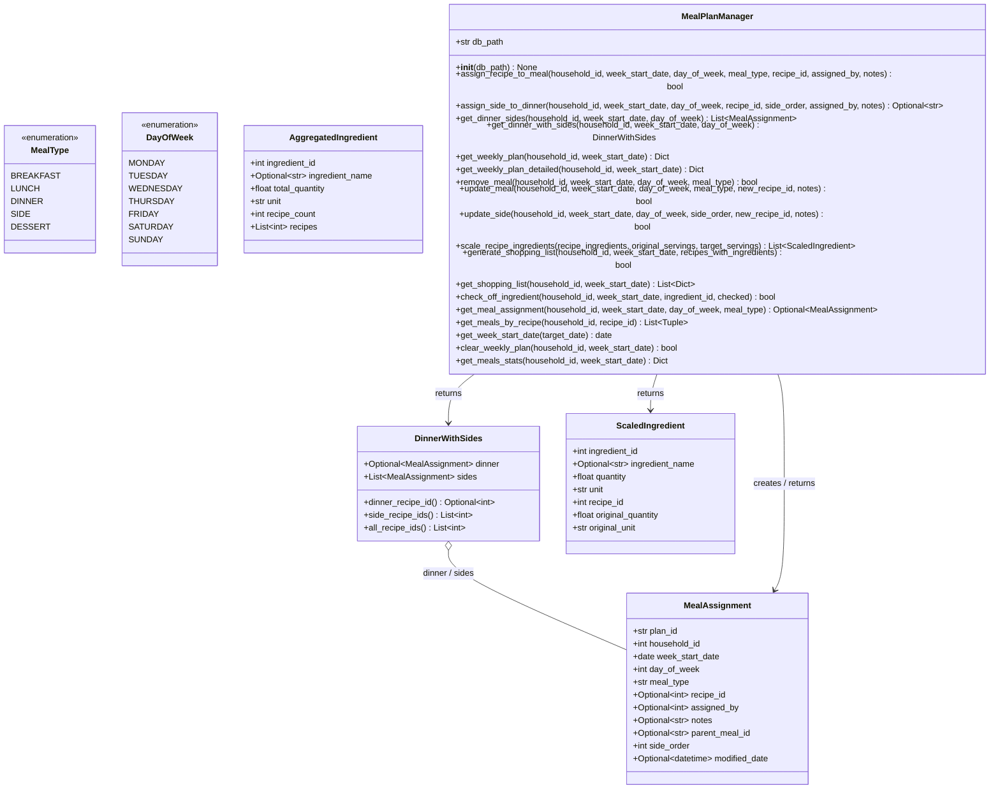

# meal_plan_manager — Ground Truth classDiagram

**Source file:** Client_Side/utils/meal_plan_manager.py
**Diagram type:** classDiagram

## Diagram

## Ground Truth Counts
- **Node count:** 7
- **Edge count:** 4
- **Notes:** DinnerWithSides has two fields typed MealAssignment (dinner and sides) — one aggregation edge since both point to the same class. AggregatedIngredient is defined but only instantiated locally inside generate_shopping_list — never returned from a public method, so no edge drawn to it. MealPlanManager does not inherit from any class in this file. DinnerWithSides has three @property methods shown as class methods. No enum associations drawn — MealPlanManager uses raw strings rather than enum instances in method signatures.
