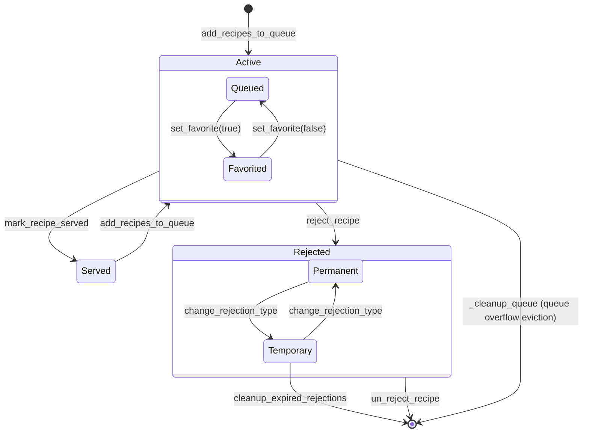

# recipe_queue_manager — Ground Truth stateDiagram-v2

**Source file:** Client_Side/utils/recipe_queue_manager.py
**Diagram type:** stateDiagram-v2

## Diagram

## Ground Truth Counts
- **State count:** 7 (Active, Queued, Favorited, Served, Rejected, Temporary, Permanent)
- **Edge count:** 11 (add_recipes_to_queue x2, set_favorite x2, mark_recipe_served, reject_recipe, change_rejection_type x2, un_reject_recipe, cleanup_expired_rejections, _cleanup_queue)
- **Notes:** Single-file state machine. Three DB tables define the states: HouseholdRecipeQueue (Active), ServingHistory (Served), RejectedRecipes (Rejected). Active has an internal flag sub-state (is_favorite) that does not change the DB table. Rejected is a true composite state with two sub-states distinguished by rejection_type column and presence/absence of expiry_date. Served is not strictly terminal — a recipe can be re-added to the queue after serving. Temporary rejection has two exit paths: explicit un_reject_recipe and automatic time-based expiry via cleanup_expired_rejections. Permanent rejection has only one exit: un_reject_recipe. Queue overflow eviction (_cleanup_queue) silently removes the oldest Active recipes back to an untracked external state with no history record.
