# seasonal_indexer — Ground Truth flowchart TB

**Source file:** Server_Side/db/seasonal_indexer.py
**Diagram type:** flowchart TB

## Diagram

```mermaid
flowchart TB
    Start([Start: main]) --> CheckFiles{seasonal_file\nexists?}
    CheckFiles -- No --> PrintError1[Print error and return]
    CheckFiles -- Yes --> CheckAllergen{allergen_file\nexists?}
    CheckAllergen -- No --> PrintError2[Print error and return]
    CheckAllergen -- Yes --> Instantiate[Instantiate SeasonalIndexer\ndb_util + setup_logging]
    Instantiate --> CallMain[process_all_seasonal_data\nseasonal_file, allergen_file]

    CallMain --> InitBuckets[initialize_seasonal_buckets]
    InitBuckets --> DBWriteBuckets["[DB: WRITE SeasonalBuckets]\n13 rows INSERT OR REPLACE"]
    DBWriteBuckets --> InitTerms[initialize_term_mappings]
    InitTerms --> DBWriteTerms["[DB: WRITE SeasonalTermMapping]\n18 rows INSERT OR REPLACE"]

    DBWriteTerms --> LoadJSON[load_seasonal_inheritance\nopen seasonal_inheritance.json]
    LoadJSON --> SeasonalDict["In-memory: seasonal_data dict"]
    SeasonalDict --> CheckKey{"'seasonal_inheritance'\nin seasonal_data?"}
    CheckKey -- No --> SkipHierarchy[Skip hierarchy processing]
    CheckKey -- Yes --> ProcessHierarchy["process_seasonal_hierarchy\nseasonal_data['seasonal_inheritance']"]

    ProcessHierarchy --> IterKeys["For each key/value\nin seasonal_data"]
    IterKeys --> BuildPath["Build current_path\npath + [key]"]
    BuildPath --> ExtractFields["Extract: seasonality_buckets,\nharvest_peak, notes"]
    ExtractFields --> HasSeasonality{seasonality_buckets\nexists?}

    HasSeasonality -- No --> CheckNested1{value is dict\nwith nested items?}
    HasSeasonality -- Yes --> NormalizeType{"seasonality_buckets\nis string?"}
    NormalizeType -- Yes --> CheckNull{"== 'null'?"}
    CheckNull -- Yes --> SetNone[Set to None]
    SetNone --> CheckNested1
    CheckNull -- No --> WrapList["Wrap in list\n[seasonality_buckets]"]
    WrapList --> CheckValid{seasonality_buckets\nnon-empty?}
    NormalizeType -- No --> CheckValid
    CheckValid -- No --> CheckNested1
    CheckValid -- Yes --> GetAllergenIDs["get_allergen_hierarchy_ids\ncurrent_path[0,1,2]"]

    GetAllergenIDs --> DBReadCategory["[DB: READ AllergenCategories]\nWHERE category_name = path[0]"]
    DBReadCategory --> CategoryFound{category_id\nfound?}
    CategoryFound -- No --> ReturnNulls1[Return None, None, None]
    ReturnNulls1 --> CheckNested1
    CategoryFound -- Yes --> HasSubcat{subcategory_name\nprovided?}
    HasSubcat -- No --> SkipSubcat[subcategory_id = None]
    HasSubcat -- Yes --> DBReadSubcat["[DB: READ AllergenSubcategories]\nWHERE category_id AND subcategory_name"]
    DBReadSubcat --> SubcatFound{subcategory_id\nfound?}
    SubcatFound -- No --> SkipSubcat
    SubcatFound -- Yes --> SetSubcat[subcategory_id = result]
    SetSubcat --> HasType{type_name AND\nsubcategory_id?}
    SkipSubcat --> HasType
    HasType -- No --> SkipType[type_id = None]
    HasType -- Yes --> DBReadType["[DB: READ AllergenTypes]\nWHERE subcategory_id AND type_name"]
    DBReadType --> TypeFound{type_id\nfound?}
    TypeFound -- No --> SkipType
    TypeFound -- Yes --> SetType[type_id = result]
    SetType --> ReturnIDs[Return category_id,\nsubcategory_id, type_id]
    SkipType --> ReturnIDs

    ReturnIDs --> CategoryValid{category_id\nnot None?}
    CategoryValid -- No --> CheckNested1
    CategoryValid -- Yes --> CreateRecord[create_seasonality_record\ncategory_id, subcategory_id, type_id,\nbuckets, harvest_peak, notes]
    CreateRecord --> SerializeJSON["seasonality_json =\njson.dumps(seasonality_buckets)"]
    SerializeJSON --> DBWriteSeasonality["[DB: WRITE AllergenSeasonality]\nINSERT OR REPLACE\ncategory_id, subcategory_id, type_id,\nseasonality_buckets, harvest_peak,\nnotes, confidence=0.9"]
    DBWriteSeasonality --> CheckNested1

    CheckNested1 -- "nested dicts exist" --> RecurseHierarchy["Recurse: process_seasonal_hierarchy\nnested_items, current_path"]
    RecurseHierarchy --> IterKeys
    CheckNested1 -- "no nested dicts / loop done" --> HierarchyDone[Hierarchy processing complete]

    SkipHierarchy --> CreateIngredientMappings
    HierarchyDone --> CreateIngredientMappings[create_ingredient_seasonality_mappings]

    CreateIngredientMappings --> DBReadIngredients["[DB: READ IngredientAllergens]\nSELECT DISTINCT ingredient_id,\ncategory_id, subcategory_id, type_id"]
    DBReadIngredients --> IngredientList["In-memory: allergen_associations list"]
    IngredientList --> IterIngredients["For each ingredient_id,\ncategory_id, subcategory_id, type_id"]
    IterIngredients --> FindSeasonality["find_seasonality_for_hierarchy\ncategory_id, subcategory_id, type_id"]

    FindSeasonality --> TryType{type_id\nprovided?}
    TryType -- Yes --> DBReadTypeLevel["[DB: READ AllergenSeasonality]\nWHERE category+subcategory+type"]
    DBReadTypeLevel --> TypeMatch{result\nfound?}
    TypeMatch -- Yes --> ReturnSpecific["Return 'specific', confidence"]
    TypeMatch -- No --> TrySubcat2{subcategory_id\nprovided?}
    TryType -- No --> TrySubcat2
    TrySubcat2 -- Yes --> DBReadSubcatLevel["[DB: READ AllergenSeasonality]\nWHERE category+subcategory,\ntype_id IS NULL"]
    DBReadSubcatLevel --> SubcatMatch{result\nfound?}
    SubcatMatch -- Yes --> ReturnSubcat["Return 'inherited_from_subcategory',\nconfidence"]
    SubcatMatch -- No --> TryCategoryLevel
    TrySubcat2 -- No --> TryCategoryLevel
    TryCategoryLevel["[DB: READ AllergenSeasonality]\nWHERE category only,\nsubcategory IS NULL, type IS NULL"]
    TryCategoryLevel --> CatMatch{result\nfound?}
    CatMatch -- Yes --> ReturnCategory["Return 'inherited_from_category',\nconfidence"]
    CatMatch -- No --> ReturnNone["Return None, 0.0"]

    ReturnSpecific --> SeasonalityFound
    ReturnSubcat --> SeasonalityFound
    ReturnCategory --> SeasonalityFound
    ReturnNone --> SeasonalityFound{seasonality_source\nnot None?}

    SeasonalityFound -- No --> NextIngredient{More\ningredients?}
    SeasonalityFound -- Yes --> DBWriteIngredientSeasonality["[DB: WRITE IngredientSeasonality]\nINSERT OR REPLACE\ningredient_id, category_id,\nsubcategory_id, type_id,\nseasonality_source, confidence"]
    DBWriteIngredientSeasonality --> IncrementCount[processed_count += 1]
    IncrementCount --> LogProgress{"processed_count\n% 1000 == 0?"}
    LogProgress -- Yes --> LogMilestone[Log milestone]
    LogProgress -- No --> NextIngredient
    LogMilestone --> NextIngredient
    NextIngredient -- Yes --> IterIngredients
    NextIngredient -- No --> CommitIngredients["[DB: COMMIT]\nIngredientSeasonality batch"]
    CommitIngredients --> LogComplete[Log: processing completed]
    LogComplete --> End([End])
```

## Ground Truth Counts
- **Node count:** 72
- **Edge count:** 83
- **Notes:** process_all_seasonal_data is the true entry point; main() is the script wrapper validating file paths. process_seasonal_hierarchy is fully recursive — back-edge from RecurseHierarchy to IterKeys. find_seasonality_for_hierarchy implements a 3-level cascade (type -> subcategory -> category); all three DB reads shown as distinct nodes. The allergen_file parameter is accepted by process_all_seasonal_data but never used (dead parameter). DB writes target four tables: SeasonalBuckets, SeasonalTermMapping, AllergenSeasonality, IngredientSeasonality. DB reads span five tables: AllergenCategories, AllergenSubcategories, AllergenTypes, IngredientAllergens, AllergenSeasonality. Batch commit for IngredientSeasonality happens after the full loop, not per-record.
