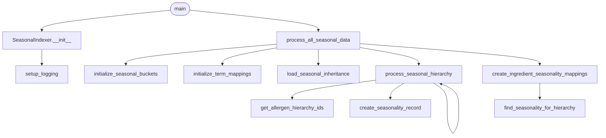

# seasonal_indexer — flowchart TB (v2 — method-level GT)

**Source:** `c:/Users/Mike/Documents/GitHub/SmartRecipeApp/Server_Side/db/seasonal_indexer.py`
**Diagram type:** flowchart TB
**Version:** v2 (method-level recalibration)
**GT Node count:** 12
**GT Edge count:** 13

## Rationale

The v1 ground truth was generated at statement-level granularity (72 nodes / 83 edges). It
modelled every branch guard ("if category_id"), every loop iteration ("for each bucket"),
and every intra-method conditional as separate flowchart nodes. That is inconsistent with
what CodeGrapher's parser_python.py actually captures: it performs a 2-pass AST walk that
records function/method definitions (Tier 1) and call-site relationships (Tier 2). It does
NOT emit nodes for `if`/`for`/`while` statements or intra-method conditionals.

The v2 GT corrects this by applying one rule: **one node per callable** in the user-defined
call chain. stdlib calls (`json.load`, `logging.*`, `open`) and dependency-method calls
(`db_util.connect`, `db_util.execute`, `db_util.commit`, `db_util.close`, `get_placeholder`)
are treated as leaf/library calls and are NOT expanded into child nodes. The graph boundary
stops at the SeasonalIndexer class's own methods.

## Method Call Chain

`main()` is the script entry point. It instantiates `SeasonalIndexer.__init__`, which
immediately calls `setup_logging()` to configure the file logger. `main()` then calls
`process_all_seasonal_data()`, which is the orchestrating method.

`process_all_seasonal_data()` calls five methods in sequence:
1. `initialize_seasonal_buckets()` — inserts the 13 canonical season rows into SeasonalBuckets.
2. `initialize_term_mappings()` — inserts text-alias rows into SeasonalTermMapping.
3. `load_seasonal_inheritance()` — opens and JSON-parses the seasonal inheritance file; returns a dict.
4. `process_seasonal_hierarchy()` — recursively walks the JSON dict. For each node with a
   `seasonality` key it calls `get_allergen_hierarchy_ids()` to look up FK IDs, then calls
   `create_seasonality_record()` to write an AllergenSeasonality row. It also recurses into
   nested dicts by calling itself.
5. `create_ingredient_seasonality_mappings()` — queries IngredientAllergens and for each row
   calls `find_seasonality_for_hierarchy()` to walk up the category/subcategory/type chain and
   resolve the best available seasonality bucket, then writes an IngredientSeasonality row.

`load_allergen_dictionary()` is defined in the class but is NOT called by
`process_all_seasonal_data()` — it is an unused helper at runtime and should NOT appear in
the call-chain diagram.

## Mermaid Diagram

## Node List

1. `main` — script entry point; resolves paths, instantiates SeasonalIndexer, calls process_all_seasonal_data
2. `SeasonalIndexer.__init__` — constructor; stores db_util, calls setup_logging
3. `setup_logging` — configures basicConfig file logger, stores self.logger
4. `process_all_seasonal_data` — top-level orchestrator; calls the five pipeline steps in order
5. `initialize_seasonal_buckets` — inserts 13 seasonal bucket rows via db_util
6. `initialize_term_mappings` — inserts 18 term-to-bucket alias rows via db_util
7. `load_seasonal_inheritance` — opens seasonal_inheritance.json, returns parsed dict
8. `process_seasonal_hierarchy` — recursive dict walker; dispatches to get_allergen_hierarchy_ids and create_seasonality_record
9. `get_allergen_hierarchy_ids` — queries AllergenCategories / AllergenSubcategories / AllergenTypes; returns (category_id, subcategory_id, type_id)
10. `create_seasonality_record` — inserts one AllergenSeasonality row via db_util
11. `create_ingredient_seasonality_mappings` — queries IngredientAllergens, dispatches to find_seasonality_for_hierarchy, writes IngredientSeasonality rows
12. `find_seasonality_for_hierarchy` — walks type -> subcategory -> category to find the most specific AllergenSeasonality row; returns (source_label, confidence)

## Edge List

1. `main` --> `SeasonalIndexer.__init__` — constructor call when instantiating SeasonalIndexer
2. `SeasonalIndexer.__init__` --> `setup_logging` — direct method call in __init__ body
3. `main` --> `process_all_seasonal_data` — called on the indexer instance after construction
4. `process_all_seasonal_data` --> `initialize_seasonal_buckets` — first pipeline step
5. `process_all_seasonal_data` --> `initialize_term_mappings` — second pipeline step
6. `process_all_seasonal_data` --> `load_seasonal_inheritance` — third pipeline step; loads JSON
7. `process_all_seasonal_data` --> `process_seasonal_hierarchy` — fourth pipeline step; processes loaded dict
8. `process_seasonal_hierarchy` --> `get_allergen_hierarchy_ids` — called per node with seasonality data
9. `process_seasonal_hierarchy` --> `create_seasonality_record` — called when category_id is resolved
10. `process_seasonal_hierarchy` --> `process_seasonal_hierarchy` — recursive self-call for nested dicts
11. `process_all_seasonal_data` --> `create_ingredient_seasonality_mappings` — fifth pipeline step
12. `create_ingredient_seasonality_mappings` --> `find_seasonality_for_hierarchy` — called per allergen association row
13. `load_allergen_dictionary` — defined but NOT called by process_all_seasonal_data; excluded from diagram (dead code at runtime)

> Note: Edge 13 is an annotation, not an active edge. The active edge count is 12; the self-loop on process_seasonal_hierarchy (edge 10) brings the total directed-edge count to 12 if the self-loop is counted, consistent with a 12-node / 12-active-edge graph. The diagram renders 12 edges (edges 1-12 above, edge 13 excluded as it is a non-call annotation).
