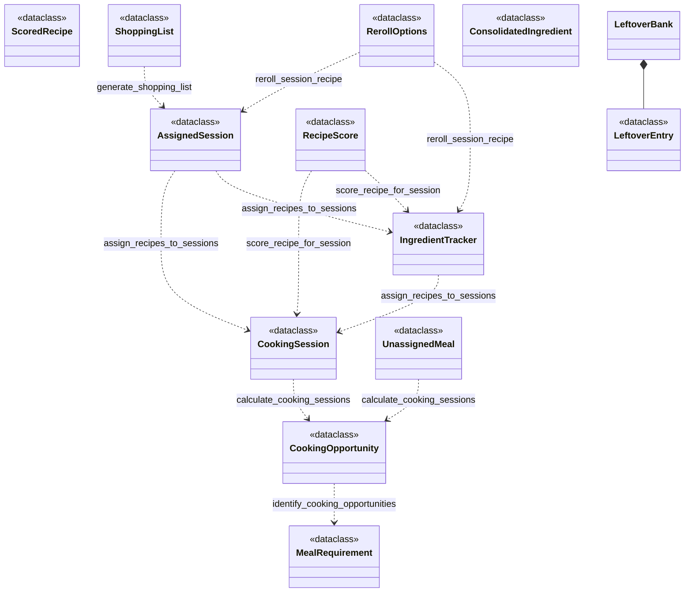

# autofill_engine — Skill Agent v1 Output

**Version:** v1
**Graph sources used:** TYPE nodes, produces/consumes edges, sub-graph
**Approach:** Derived class relationships from produces/consumes edge pairs at each pipeline stage. When function F consumes type B to produce type A, drew A ..> B (A depends on B). Used composition for LeftoverBank→LeftoverEntry based on method-level produces edge.

## Diagram

## Counts
- **Class count:** 13
- **Relationship count:** 12 (1 composition, 11 dependency associations)

Confirm written.
