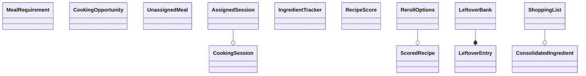

# autofill_engine.py — classDiagram (v2)

**Source:** Client_Side/utils/autofill_engine.py
**Diagram type:** classDiagram
**Version:** v2

## Mermaid Diagram

## Node List

1. MealRequirement
2. CookingOpportunity
3. CookingSession
4. UnassignedMeal
5. AssignedSession
6. IngredientTracker
7. RecipeScore
8. ScoredRecipe
9. RerollOptions
10. LeftoverEntry
11. LeftoverBank
12. ConsolidatedIngredient
13. ShoppingList

## Edge Justification

1. **AssignedSession --o CookingSession**
   Field declaration (line 190): `session: CookingSession`
   AssignedSession holds a direct reference to a CookingSession object.

2. **RerollOptions --o ScoredRecipe**
   Field declarations (lines 414-415):
   `favorites: List[ScoredRecipe]`
   `other_options: List[ScoredRecipe]`
   RerollOptions holds two list fields whose element type is ScoredRecipe.

3. **LeftoverBank --* LeftoverEntry**
   Field declaration (line 460, in `__init__`): `self.entries: Dict[str, LeftoverEntry] = {}`
   LeftoverBank owns (composes) LeftoverEntry objects in its entries dict. Composition is used because LeftoverEntry instances are created inside LeftoverBank.add_cooked_meal and their lifecycle is fully managed by the bank.

4. **ShoppingList --o ConsolidatedIngredient**
   Field declaration (line 2956): `consolidated: Dict[str, ConsolidatedIngredient]`
   ShoppingList holds a dict whose value type is ConsolidatedIngredient.
