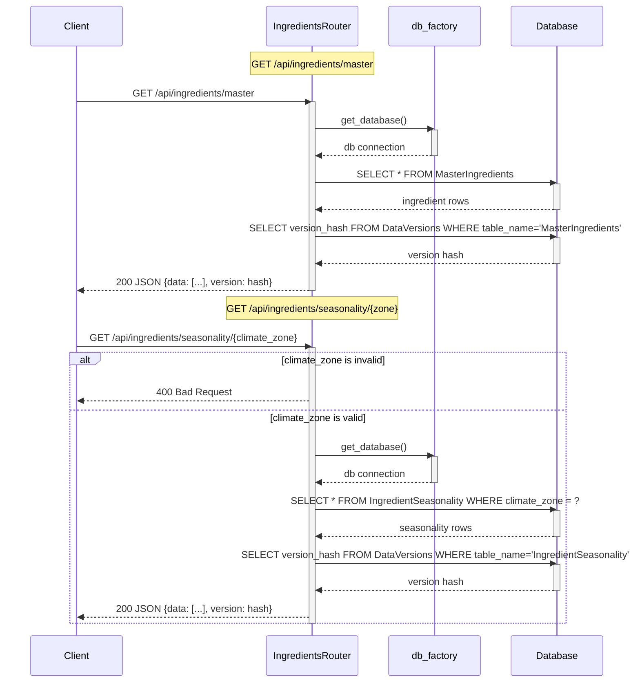

# ingredients_routes — Skill Agent v1 Output

**Version:** v1
**Graph sources used:** cross_file edges to db_factory, files_touched
**Approach:** Two separate flows from two cross-file edge pairs. Validation alt-block for climate_zone per skill rules. DataVersions version-hash query appended to each route.

## Diagram

## Counts
- **Actor count:** 4 (Client, IngredientsRouter, db_factory, Database)
- **Message count:** 19 total arrows
