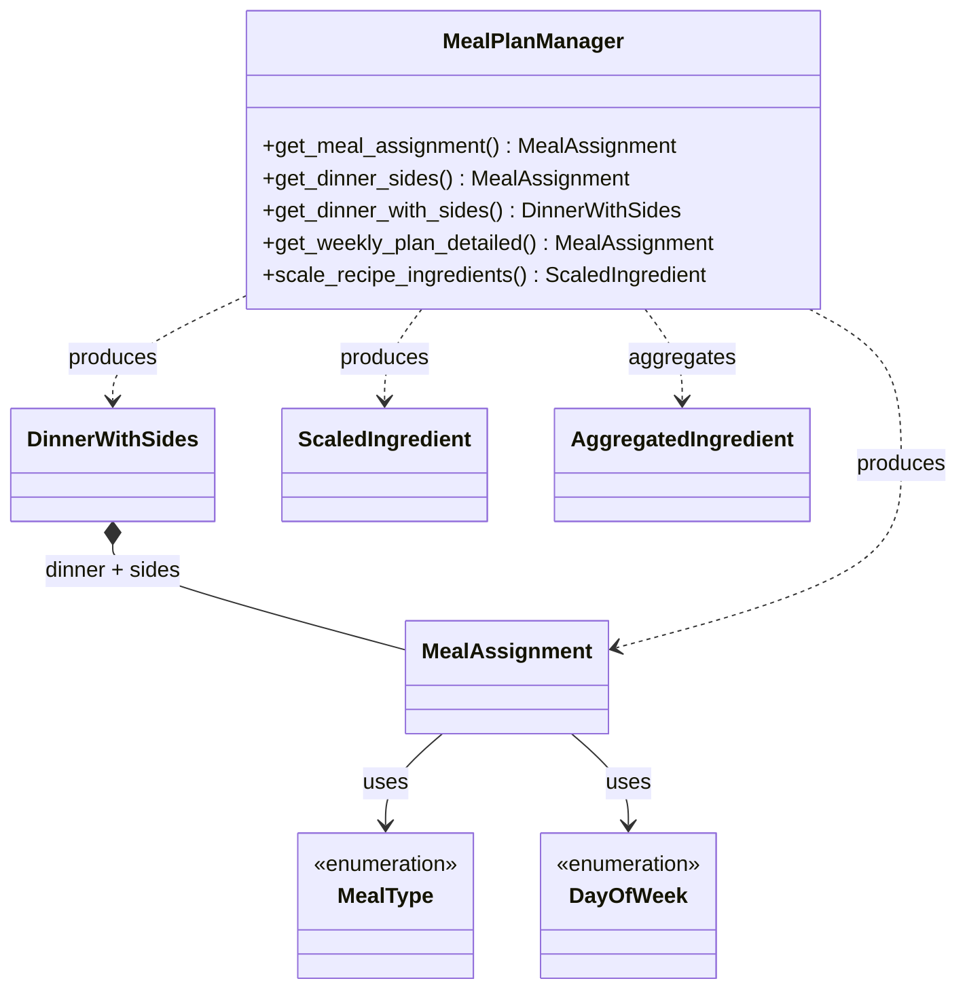

# meal_plan_manager — Skill Agent v1 Output

**Version:** v1
**Graph sources used:** TYPE nodes, produces edges, calls edges
**Approach:** Each TYPE node becomes a class box. Enums use <<enumeration>> stereotype. Relationships derived from produces edges (dependency arrows from MealPlanManager to return types), composition from DinnerWithSides call chain, and enum-to-MealAssignment association from file proximity inference.

## Diagram

## Counts
- **Class count:** 7
- **Relationship count:** 8

Confirm written.
