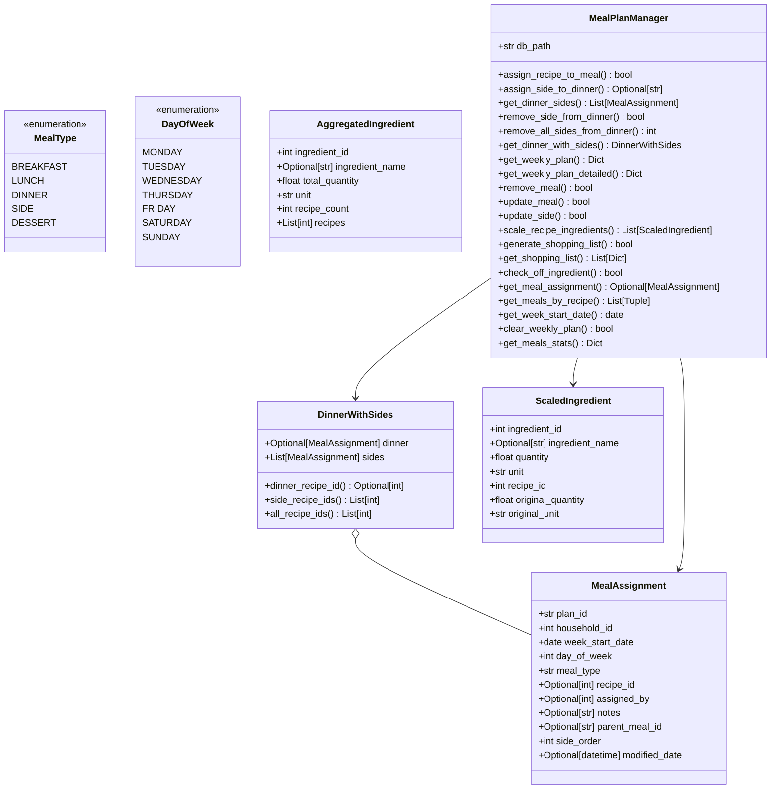

# meal_plan_manager.py — classDiagram (v2)

**Source:** Client_Side/utils/meal_plan_manager.py
**Diagram type:** classDiagram
**Version:** v2

## Mermaid Diagram

## Node List

1. MealType — enumeration (BREAKFAST, LUNCH, DINNER, SIDE, DESSERT)
2. DayOfWeek — enumeration (MONDAY, TUESDAY, WEDNESDAY, THURSDAY, FRIDAY, SATURDAY, SUNDAY)
3. MealAssignment — dataclass; single meal slot assignment (plan_id, household_id, week_start_date, day_of_week as int, meal_type as str, etc.)
4. DinnerWithSides — dataclass; holds an optional dinner MealAssignment and a list of side MealAssignments
5. ScaledIngredient — dataclass; ingredient with scaled quantity (ingredient_id, quantity, unit, original_quantity, original_unit)
6. AggregatedIngredient — dataclass; aggregated ingredient across multiple recipes (ingredient_id, total_quantity, unit, recipe_count, recipes)
7. MealPlanManager — manager class; handles weekly meal planning, scaling, and shopping list generation

## Edge Justification

- **DinnerWithSides o-- MealAssignment**: `DinnerWithSides` declares two fields typed as `MealAssignment`: `dinner: Optional[MealAssignment]` (line 65) and `sides: List[MealAssignment]` (line 66). Aggregation is used because `DinnerWithSides` holds but does not own the `MealAssignment` instances.
- **MealPlanManager --> MealAssignment**: `get_meal_assignment()` has return type `Optional[MealAssignment]` (line 1077); `get_dinner_sides()` has return type `List[MealAssignment]` (line 302); `_row_to_meal_assignment()` has return type `MealAssignment` (line 1055) and is a core internal factory used throughout the public API.
- **MealPlanManager --> DinnerWithSides**: `get_dinner_with_sides()` has return type `DinnerWithSides` (line 427) and constructs and returns a `DinnerWithSides` instance (line 441).
- **MealPlanManager --> ScaledIngredient**: `scale_recipe_ingredients()` has return type `List[ScaledIngredient]` (line 725) and constructs `ScaledIngredient` instances throughout its body.

## Rejected Edges

- **MealPlanManager --> MealType**: Rejected. `MealPlanManager` stores meal types as raw `str` fields (e.g., `MAIN_MEAL_TYPES = ["breakfast", "lunch", "dinner", "dessert"]` at line 124) and receives `meal_type: str` parameters. No field or return type is declared as `MealType` enum.
- **MealPlanManager --> DayOfWeek**: Rejected. `MealPlanManager` stores days as raw `int` values (e.g., `day_of_week: int` parameters throughout) and `DAYS_OF_WEEK` is a plain `Dict[int, str]` (line 113). No field or return type is declared as `DayOfWeek` enum.
- **MealAssignment --> MealType**: Rejected. `MealAssignment.meal_type` is declared `str` (line 53), not `MealType`.
- **MealAssignment --> DayOfWeek**: Rejected. `MealAssignment.day_of_week` is declared `int` (line 52), not `DayOfWeek`.
- **MealPlanManager --> AggregatedIngredient**: Rejected. `AggregatedIngredient` is used only as a local variable inside `generate_shopping_list()` (line 884) which returns `bool`. It is never returned from any public method.
- **DinnerWithSides --> ScaledIngredient / AggregatedIngredient**: Rejected. No field or method on `DinnerWithSides` references either type.
