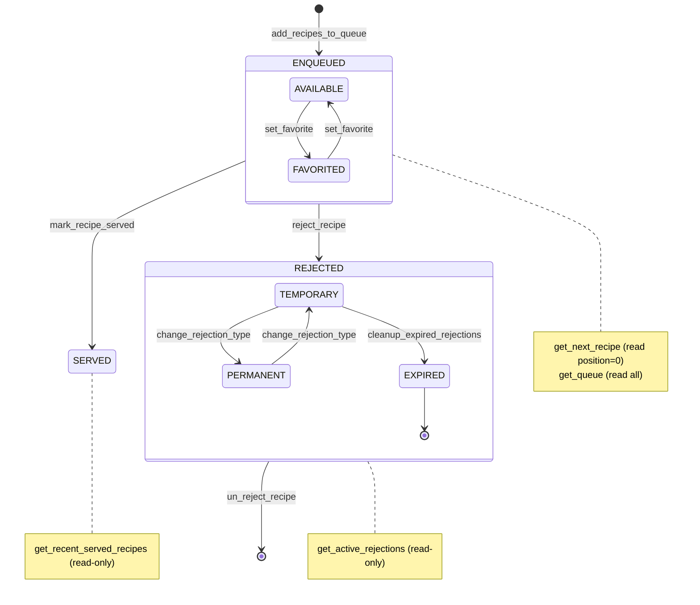

# recipe_queue_manager — Skill Agent v1 Output

**Version:** v1
**Graph sources used:** symbol names + calls edges (intra-file state machine inference)
**Approach:** Method names mapped to lifecycle states. Composite states used for REJECTED (TEMPORARY/PERMANENT) and ENQUEUED (AVAILABLE/FAVORITED). Read-only methods shown as notes.

## Diagram

## Counts
- **State count:** 9 (ENQUEUED, AVAILABLE, FAVORITED, SERVED, REJECTED, TEMPORARY, PERMANENT, EXPIRED, plus [*])
- **Edge count:** 10 transitions
