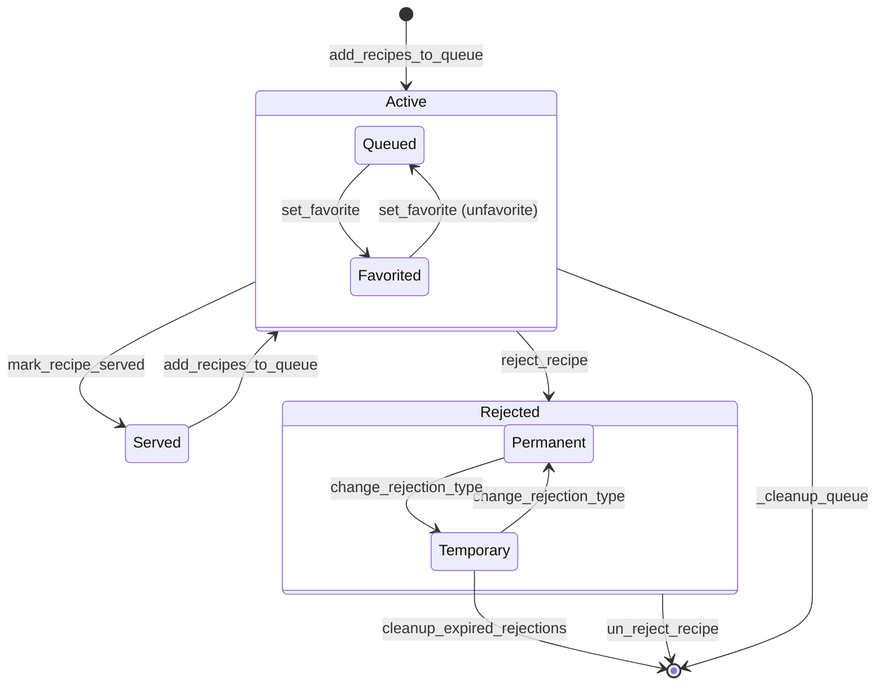

# recipe_queue_manager.py — stateDiagram-v2 (v2)

**Source:** Client_Side/utils/recipe_queue_manager.py
**Diagram type:** stateDiagram-v2
**Version:** v2

## Mermaid Diagram

## State List

1. **Active** (composite) — recipe is in `HouseholdRecipeQueue`; contains two sub-states based on the `is_favorite` column
2. **Queued** — sub-state of Active; `is_favorite = FALSE` (default)
3. **Favorited** — sub-state of Active; `is_favorite = TRUE`
4. **Served** — recipe has been removed from `HouseholdRecipeQueue` and recorded in `ServingHistory`; NOT terminal — can re-enter Active
5. **Rejected** (composite) — recipe is in `RejectedRecipes`; contains two sub-states based on the `rejection_type` column
6. **Temporary** — sub-state of Rejected; `rejection_type = 'temporary'`, has a 30-day `expiry_date`
7. **Permanent** — sub-state of Rejected; `rejection_type = 'permanent'`, `expiry_date = NULL`

## Transition Justification

| # | Edge | Method | Relevant Lines |
|---|------|---------|---------------|
| 1 | `[*] --> Active` | `add_recipes_to_queue` | Lines 29-76: `INSERT OR IGNORE INTO HouseholdRecipeQueue` — recipe enters the queue for the first time |
| 2 | `Queued --> Favorited` | `set_favorite` | Lines 560-590: `UPDATE HouseholdRecipeQueue SET is_favorite = ?` with `is_favorite=True` |
| 3 | `Favorited --> Queued` | `set_favorite` (unfavorite) | Lines 560-590: same UPDATE with `is_favorite=False`; same method, boolean arg controls direction |
| 4 | `Active --> Served` | `mark_recipe_served` | Lines 107-174: `DELETE FROM HouseholdRecipeQueue` + `INSERT INTO ServingHistory` — recipe leaves Active queue |
| 5 | `Served --> Active` | `add_recipes_to_queue` | Line 111 docstring: "User can add it back later if they want it in rotation again"; `add_recipes_to_queue` uses `INSERT OR IGNORE` so a previously served recipe can be re-inserted |
| 6 | `Active --> Rejected` | `reject_recipe` | Lines 178-228: `INSERT OR REPLACE INTO RejectedRecipes` + `DELETE FROM HouseholdRecipeQueue` — recipe moves from queue to rejection list |
| 7 | `Temporary --> Permanent` | `change_rejection_type` | Lines 230-271: `UPDATE RejectedRecipes SET rejection_type = ?` with `new_type='permanent'`; sets `expiry_date=NULL` |
| 8 | `Permanent --> Temporary` | `change_rejection_type` | Lines 230-271: same UPDATE with `new_type='temporary'`; sets `expiry_date = today + 30 days` |
| 9 | `Rejected --> [*]` | `un_reject_recipe` | Lines 273-301: `DELETE FROM RejectedRecipes` — recipe is removed from rejection list entirely |
| 10 | `Temporary --> [*]` | `cleanup_expired_rejections` | Lines 466-498: `DELETE FROM RejectedRecipes WHERE rejection_type = 'temporary' AND expiry_date < today` — only Temporary records have a non-NULL expiry_date that can expire |
| 11 | `Active --> [*]` | `_cleanup_queue` | Lines 500-558: `DELETE FROM HouseholdRecipeQueue` for oldest-position recipes when `queue_size > max_queue_size`; called internally by `add_recipes_to_queue` (line 67) — overflow eviction terminates Active directly |

## Prompt Rules Applied

### Rule (a) — cleanup/eviction goes directly to [*]
Applied to `_cleanup_queue` (lines 521-538). v1 apparently routed this through an intermediate node. This version draws `Active --> [*] : _cleanup_queue` directly, as the DELETE removes the recipe row from `HouseholdRecipeQueue` with no further state recording.

### Rule (b) — Served --> Active re-entry drawn explicitly
Applied based on the docstring at line 111: "User can add it back later if they want it in rotation again." The `add_recipes_to_queue` method uses `INSERT OR IGNORE`, meaning a previously served recipe that is passed in again re-enters `HouseholdRecipeQueue` normally. v1 was missing this edge; it is now drawn as `Served --> Active : add_recipes_to_queue`.

### Rule (c) — no fabricated intermediate sub-states
v1 inserted an `EXPIRED` intermediate sub-state inside Rejected. The source code has no such state — `cleanup_expired_rejections` issues a single `DELETE` that terminates Temporary records directly. This version draws `Temporary --> [*] : cleanup_expired_rejections` without any intermediate node.
