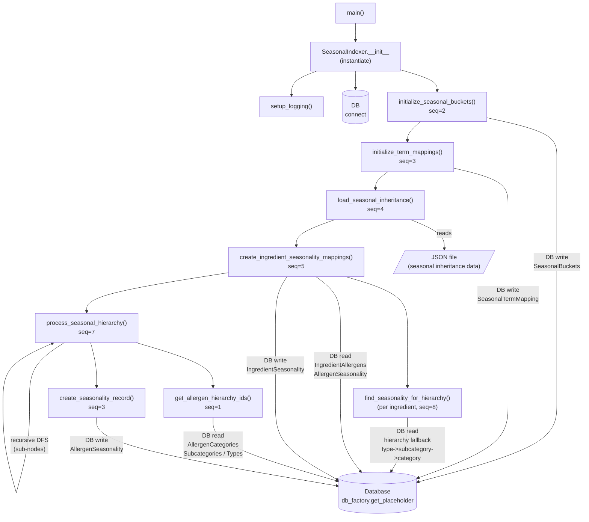

# seasonal_indexer — Skill Agent v1 Output

**Version:** v1
**Graph sources used:** calls edges with seq, cross_file edges to db_factory
**Approach:** Ordered pipeline steps by seq number on process_all_seasonal_data calls; mapped cross-file edges to db_factory.get_placeholder as DB interaction nodes; surfaced recursive call in process_seasonal_hierarchy as a self-loop; grouped sub-calls within each pipeline stage.

## Diagram

## Counts
- **Node count:** 15
- **Edge count:** 20

Confirm written.
