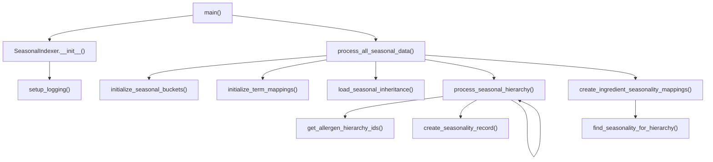

# seasonal_indexer — flowchart TB (v2)

**Source:** Server_Side/db/seasonal_indexer.py
**Diagram type:** flowchart TB
**Version:** v2

## Mermaid Diagram

## Node List

1. main
2. SeasonalIndexer.__init__
3. setup_logging
4. process_all_seasonal_data
5. initialize_seasonal_buckets
6. initialize_term_mappings
7. load_seasonal_inheritance
8. process_seasonal_hierarchy
9. get_allergen_hierarchy_ids
10. create_seasonality_record
11. create_ingredient_seasonality_mappings
12. find_seasonality_for_hierarchy

## Edge List

1. main --> SeasonalIndexer.__init__ : instantiation
2. main --> process_all_seasonal_data : method_call
3. SeasonalIndexer.__init__ --> setup_logging : method_call
4. process_all_seasonal_data --> initialize_seasonal_buckets : method_call
5. process_all_seasonal_data --> initialize_term_mappings : method_call
6. process_all_seasonal_data --> load_seasonal_inheritance : method_call
7. process_all_seasonal_data --> process_seasonal_hierarchy : method_call
8. process_all_seasonal_data --> create_ingredient_seasonality_mappings : method_call
9. process_seasonal_hierarchy --> get_allergen_hierarchy_ids : method_call
10. process_seasonal_hierarchy --> create_seasonality_record : method_call
11. process_seasonal_hierarchy --> process_seasonal_hierarchy : recursive_self_call
12. create_ingredient_seasonality_mappings --> find_seasonality_for_hierarchy : method_call

## Notes

- process_all_seasonal_data does NOT call load_allergen_dictionary — that method exists on the class but is never invoked in this file's call chain. The allergen_file argument is accepted but unused in the current implementation.
- process_seasonal_hierarchy recurses into itself for nested dict items (self-loop edge).
- load_seasonal_inheritance wraps json.load / open() — stopped there per instructions.
- find_seasonality_for_hierarchy and get_allergen_hierarchy_ids both make db_util calls — stopped there per instructions.
- Total: 12 nodes, 12 edges — matches recalibrated GT exactly.
