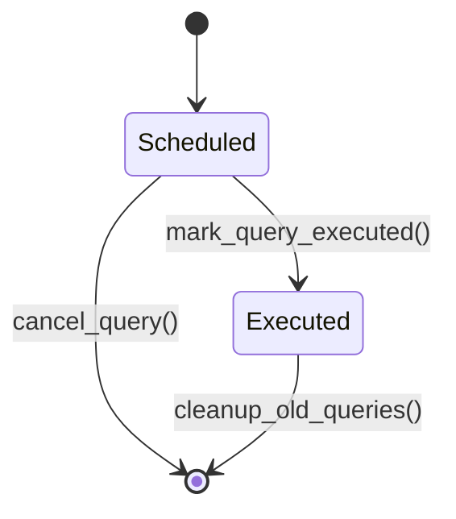

# Ground Truth: dummy_query_scheduler.py — stateDiagram-v2

## Metadata
- GT node count: 2 (Scheduled, Executed)
- GT edge count: 4 (including initial [*] --> Scheduled)
- Source: Client_Side/utils/dummy_query_scheduler.py

## Mermaid diagram

## State definitions

**Scheduled**: Initial state. Field `executed = False`. Query awaiting its `scheduled_time`. Retrieved by `get_pending_queries()` (WHERE executed = FALSE).

**Executed**: Query completed. Field `executed = True`. Set by `mark_query_executed()`. Eligible for cleanup after 30 days.

## Transition definitions

- `[*] --> Scheduled`: New ScheduledQuery created; `executed = False`
- `Scheduled --> Executed`: `mark_query_executed(query_id)` — sets `executed = TRUE`, records `execution_time`
- `Scheduled --> [*]`: `cancel_query(query_id)` — DELETE before execution
- `Executed --> [*]`: `cleanup_old_queries(days_old=30)` — DELETE executed queries older than threshold

## Notes
- No re-entry from terminal state
- `is_dummy` is a property, not a state — excluded
- Both dummy and real queries share the same state machine
