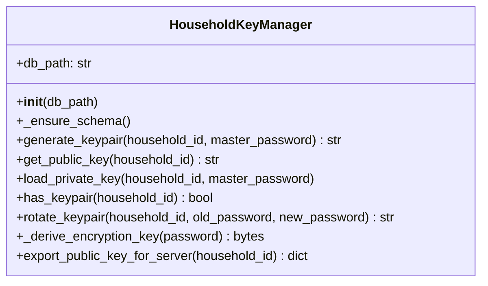

# Ground Truth: key_manager.py — classDiagram

## Metadata
- GT node count: 1
- GT edge count: 0
- Source: Client_Side/utils/key_manager.py

## Mermaid diagram

## Notes
Single class: HouseholdKeyManager.

No structural edges:
- Only field is `db_path: str` — built-in primitive, no custom class
- Cryptography objects (RSA keys, Fernet) are instantiated and used locally within methods — never stored as instance fields
- No other custom classes defined in this file

Zero-edge diagrams are valid: the rule is field-type declarations only, and none exist here.
