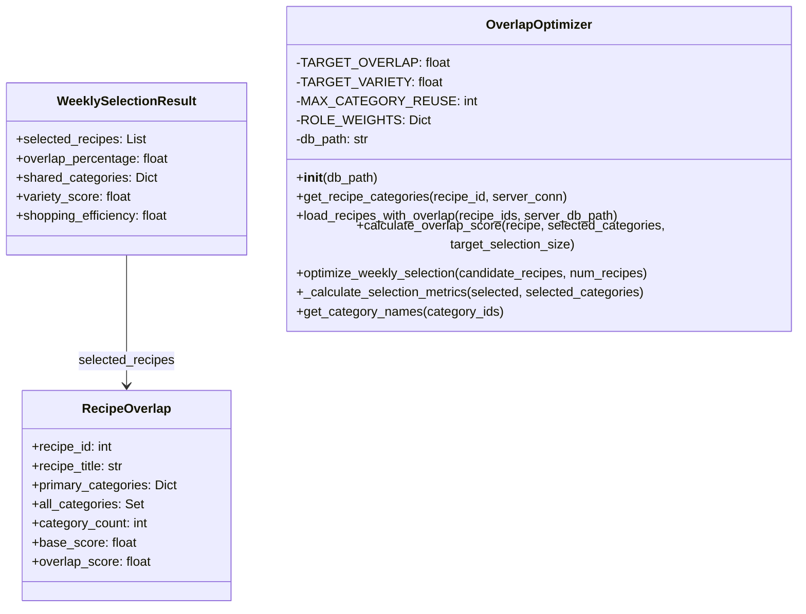

# Ground Truth: overlap_optimizer.py — classDiagram

## Metadata
- GT node count: 3
- GT edge count: 1
- Source: Client_Side/utils/overlap_optimizer.py

## Mermaid diagram

## Notes
Single edge: WeeklySelectionResult.selected_recipes is declared as List[RecipeOverlap] — explicit field-type relationship.

Excluded:
- Method parameters (recipe: RecipeOverlap, candidate_recipes: List[RecipeOverlap]) — parameter types, not fields
- Return types (functions returning RecipeOverlap or WeeklySelectionResult) — not structural
- OverlapOptimizer has no field of type RecipeOverlap or WeeklySelectionResult
