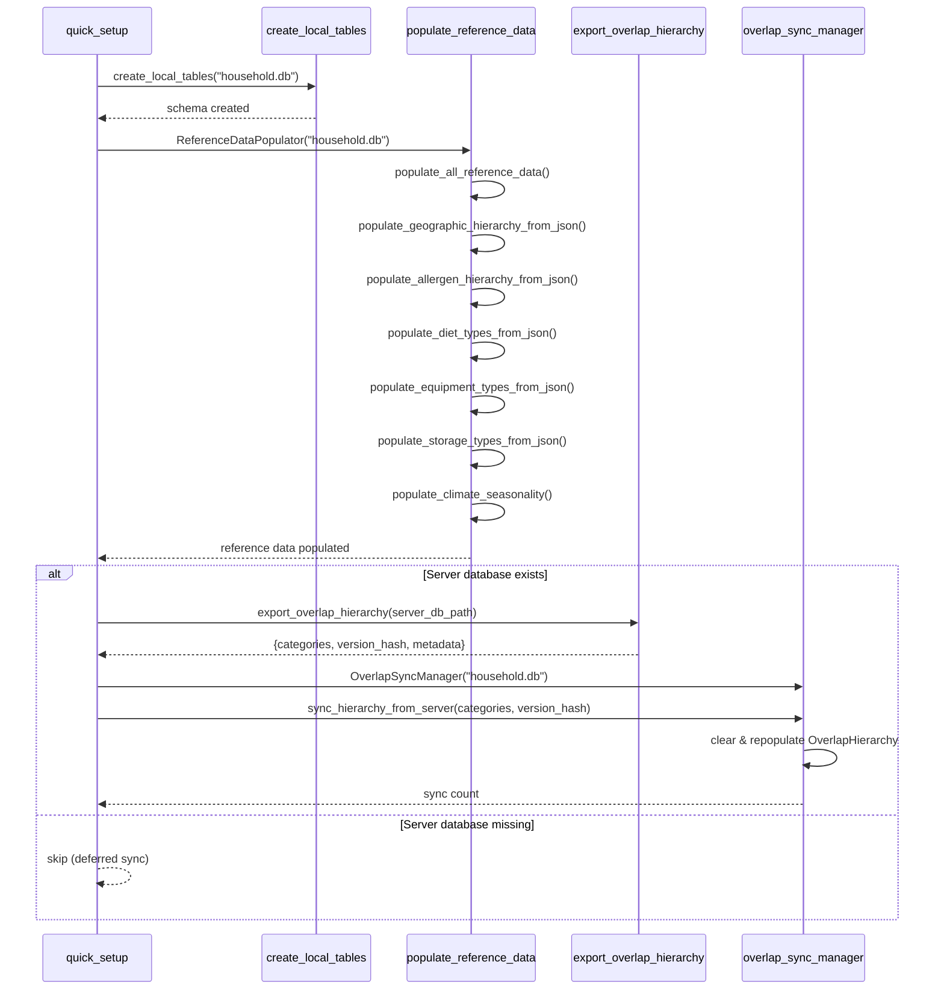

# Ground Truth: quick_setup.py — sequenceDiagram

## Metadata
- GT actor count: 5 (quick_setup, create_local_tables, populate_reference_data, export_overlap_hierarchy, overlap_sync_manager)
- GT message count: 9 cross-file calls (excludes intra-actor self-calls)
- Source: Client_Side/first_boot/quick_setup.py

## Mermaid diagram

## Notes
Cross-file actors (5): quick_setup, create_local_tables, populate_reference_data, export_overlap_hierarchy (Server_Side), overlap_sync_manager.

Cross-file calls from quick_setup:
1. create_local_tables("household.db")
2. ReferenceDataPopulator("household.db") — constructor
3. export_overlap_hierarchy(server_db_path)
4. OverlapSyncManager("household.db") — constructor
5. sync_hierarchy_from_server(categories, version_hash)

The export_overlap_hierarchy is a conditional import (alt block) — only runs if server DB exists.
populate_reference_data self-calls are internal methods within that file — may not be visible in graph.
