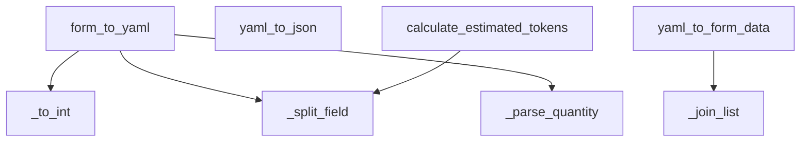

# Ground Truth: recipe_yaml_converter.py — flowchart TB

## Metadata
- GT node count: 8
- GT edge count: 5
- Source: Client_Side/utils/recipe_yaml_converter.py

## Mermaid diagram

## Notes
Entry functions: form_to_yaml, yaml_to_json, yaml_to_form_data, calculate_estimated_tokens
Helper methods: _to_int, _split_field, _parse_quantity, _join_list

Call edges (method-level only, no statement-level branching):
- form_to_yaml → _to_int
- form_to_yaml → _split_field
- form_to_yaml → _parse_quantity
- yaml_to_form_data → _join_list
- calculate_estimated_tokens → _split_field

yaml_to_json: uses yaml library directly, no intra-project helper calls → isolated node.
