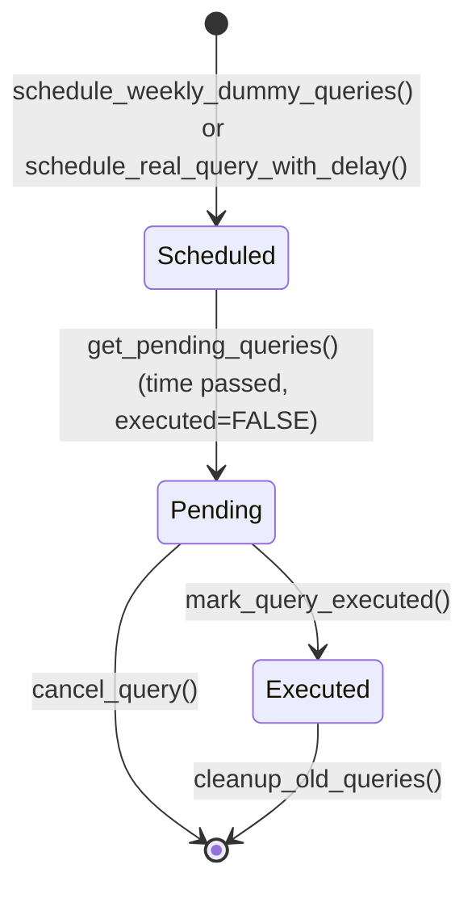

# Skill Output: dummy_query_scheduler.py — stateDiagram-v2

## Graph data summary
- Method nodes found: __init__, schedule_weekly_dummy_queries, schedule_real_query_with_delay, get_pending_queries, mark_query_executed, cancel_query, cleanup_old_queries, should_execute_query, generate_dummy_query_params, add_timing_delay, get_query_statistics
- Enum/status nodes found: ScheduledQuery (dataclass with executed: bool, is_dummy: bool)

## Mermaid diagram

## Reasoning
- States inferred from ScheduledQuery.executed field (False=Scheduled/Pending, True=Executed)
- get_pending_queries() treated as Scheduled→Pending transition (time-based filter)
- cancel_query() and cleanup_old_queries() applied cleanup rule (direct → [*])
- No re-entry detected
