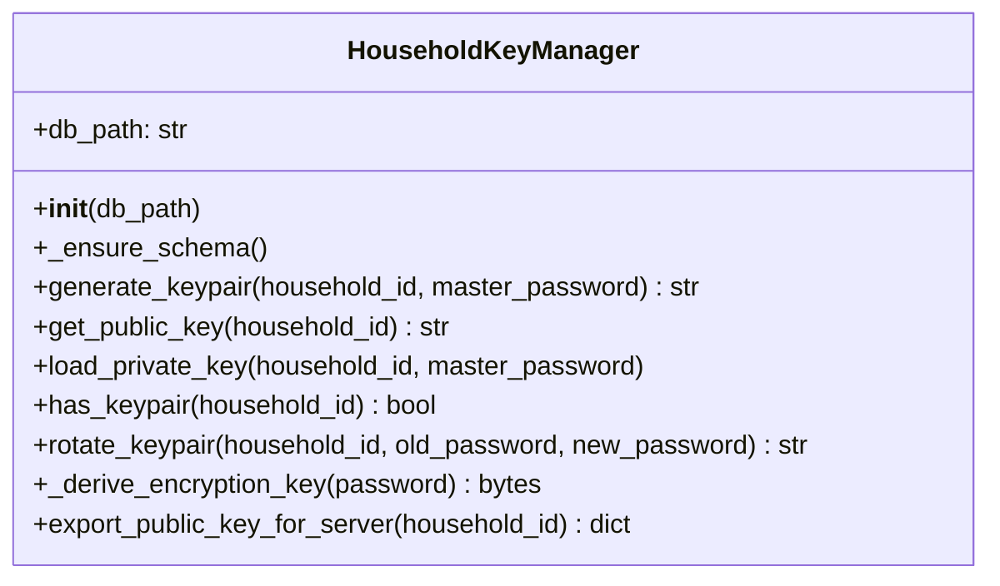

# Skill Output: key_manager.py — classDiagram

## Graph data summary
- TYPE nodes (classes): HouseholdKeyManager (1 total)
- SYMBOL nodes: 9 (methods: __init__, _ensure_schema, generate_keypair, get_public_key, load_private_key, has_keypair, rotate_keypair, _derive_encryption_key, export_public_key_for_server)
- Structural edges: 0 — no consumes edges on __init__ indicating custom type fields; only db_path: str (built-in)

## Mermaid diagram

## Reasoning
No inter-class edges: graph shows no consumes edges on __init__ for custom type fields. Only field is db_path (str, built-in). Cryptography objects appear as local method variables — not stored as class fields — so no structural edges per SKILL.md classDiagram rule.
